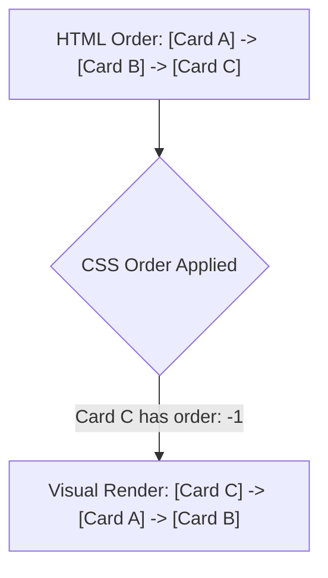

# Order

Estimated Reading Time: 12 minutes

Prerequisites: [CSS Flexbox](29-css-flexbox.md)

Learning Objectives:
- Master the `order` property in Flexbox and CSS Grid.
- Rearrange visual display sequence of child items without modifying HTML DOM order.
- Understand default integer values (`order: 0`) and negative order values.
- Re-order mobile vs desktop responsive content layouts.

---

## Introduction

The `order` property specifies the visual rendering sequence of individual child flex items inside a Flexbox (or CSS Grid) container.

By default, flex items render in the exact physical order they appear in the HTML source code (`order: 0`). Assigning integer values (`order: 1`, `order: -1`) allows developers to re-order items visually without modifying underlying HTML markup.

---

## Real-World Analogy

Imagine a track relay team standing in line based on jersey numbers.

- **Default State (`order: 0`)**: Runners standing in natural queue order according to their HTML sign-up sheet (Runner 1, Runner 2, Runner 3).
- **`order: -1`**: Giving Runner 3 a VIP fast-pass ticket, allowing them to step past everyone else to the very front of the line.
- **`order: 5`**: Moving Runner 1 to the back of the line.

`order` adjusts visual sequence position without rewriting the sign-up roster (HTML).

---

## Core Concepts

### 1. Integer Values
- Default value is `0` for all flex items.
- Items are rendered in ascending numerical `order` value: `-2`, `-1`, `0`, `1`, `2`.
- If two items share the same `order` value, they render in their natural HTML source order.

### 2. Negative Order Values
Setting `order: -1` moves an item **before** default `0` items, placing it at the very start of the container.

### 3. Visual vs DOM Disconnect
`order` changes **only visual rendering sequence**. Keyboard tabbing order and screen readers continue following the original HTML DOM source structure.

---

## Syntax

```css
/* Move item to front */
.first-item {
    order: -1;
}

/* Move item to end */
.last-item {
    order: 99;
}

/* Responsive Re-Ordering */
@media (max-width: 768px) {
    .sidebar {
        order: 2; /* Push sidebar below main content on mobile */
    }
    .main-content {
        order: 1; /* Elevate main content to top on mobile */
    }
}
```

---

## Property Reference

| Value | Rendering Sequence Position | Usage |
| :--- | :--- | :--- |
| `0` (Default) | Standard HTML source order | Base state |
| Negative (`-1`, `-2`) | Moves item towards the **start** | Moving feature badges to front |
| Positive (`1`, `2`, `99`) | Moves item towards the **end** | Moving sidebars below mobile content |

---

## Visual Explanation



---

## Example 1

### HTML
```html
<!DOCTYPE html>
<html lang="en">
<head>
    <meta charset="UTF-8">
    <title>Flexbox Order Property</title>
    <style>
        body { font-family: Arial, sans-serif; padding: 30px; background-color: #f8fafc; }
        
        .flex-row {
            display: flex;
            gap: 15px;
            background-color: #ffffff;
            border: 1px solid #cbd5e1;
            padding: 20px;
            border-radius: 8px;
        }
        
        .box {
            flex: 1;
            background-color: #2563eb;
            color: white;
            padding: 20px;
            border-radius: 6px;
            text-align: center;
        }
        
        /* Re-ordering rules */
        .box-1 { order: 2; background-color: #0284c7; }
        .box-2 { order: 3; background-color: #16a34a; }
        .box-3 { order: 1; background-color: #dc2626; } /* Moves to front! */
    </style>
</head>
<body>
    <div class="flex-row">
        <div class="box box-1">Box 1 (HTML 1st / CSS order: 2)</div>
        <div class="box box-2">Box 2 (HTML 2nd / CSS order: 3)</div>
        <div class="box box-3">Box 3 (HTML 3rd / CSS order: 1)</div>
    </div>
</body>
</html>
```

### CSS
```css
.box-1 { order: 2; }
.box-2 { order: 3; }
.box-3 { order: 1; }
```

### Explanation
Even though Box 3 is written 3rd in HTML, setting `order: 1` renders red Box 3 first visually.

---

## Output Image Prompt

A browser window showing 3 colored boxes inside a row container. Red Box 3 renders first on the left, blue Box 1 renders second in the middle, and green Box 2 renders third on the right.

---

## Code Explanation

- `order: 1;`: Elevator Box 3 to first position because its integer value is lower than Box 1 (`order: 2`) and Box 2 (`order: 3`).

---

## Example 2

### HTML
```html
<!DOCTYPE html>
<html lang="en">
<head>
    <meta charset="UTF-8">
    <title>Responsive Mobile Sidebar Order</title>
    <style>
        body { font-family: Arial, sans-serif; padding: 20px; }
        
        .layout {
            display: flex;
            flex-direction: column;
            gap: 15px;
        }
        
        .sidebar { order: 2; background-color: #e2e8f0; padding: 20px; }
        .content { order: 1; background-color: #2563eb; color: white; padding: 20px; }
        
        @media (min-width: 768px) {
            .layout { flex-direction: row; }
            .sidebar { order: 1; flex: 1; }
            .content { order: 2; flex: 3; }
        }
    </style>
</head>
<body>
    <div class="layout">
        <div class="sidebar">Sidebar (HTML 1st)</div>
        <div class="content">Main Content (HTML 2nd)</div>
    </div>
</body>
</html>
```

### CSS
```css
/* Mobile: Content 1st, Sidebar 2nd */
.sidebar { order: 2; }
.content { order: 1; }

/* Desktop: Sidebar 1st, Content 2nd */
@media (min-width: 768px) {
    .sidebar { order: 1; }
    .content { order: 2; }
}
```

### Explanation
Mobile screens display Main Content above Sidebar using `order: 1`. Desktop screens restore Sidebar to the left of Main Content using media queries.

---

## Output Image Prompt

A browser window showing Main Content stacked above Sidebar on mobile screen viewports, changing to Sidebar on the left of Main Content on desktop screen viewports.

---

## Code Explanation

- `order: 1;` / `order: 2;`: Re-orders content visually across responsive mobile and desktop layout views.

---

## Best Practices

- **Use `order` Sparingly to Protect Accessibility**: Avoid heavy visual re-ordering because screen readers and keyboard `Tab` navigation follow original HTML DOM source order, which can confuse visually impaired users.
- **Use Negative Numbers (`-1`) to Push to Front**: Use `order: -1` to push single feature cards or badges to the front of a list without touching sibling items.

---

## Common Mistakes

### Mistake 1: Setting `order` on Parent Container

```css
/* INCORRECT */
.flex-container {
    display: flex;
    order: 1; /* Ignored! Belongs on child flex items */
}
```

#### Explanation
`order` is a **flex item property**, not a container property.

```css
/* CORRECT */
.flex-container { display: flex; }
.flex-item { order: 1; }
```

---

## Browser Compatibility

CSS `order` has 100% universal support across all desktop and mobile browsers.

---

## Real-World Applications

- **Responsive Mobile Layouts**: Displaying article main text above sidebars on smartphones.
- **Featured Card Badges**: Moving "Recommended Plan" cards to the first slot in pricing tables.
- **Form Input Rearrangement**: Re-ordering form buttons dynamically.

---

## Mini Project

### Project Objective: Responsive Content/Sidebar Re-Ordering
Build a 2-column layout where Main Content renders above Sidebar on mobile (`order: 1`), but Sidebar renders on the left on desktop.

---

## Practice Exercises

### Beginner Level
1. Move a flex item to the front using `order: -1;`.
2. Move a flex item to the end using `order: 99;`.
3. Set default order explicitly using `order: 0;`.
4. Re-order 3 flex boxes visually without modifying HTML.
5. Re-order flex items inside a media query.

### Intermediate Level
6. Push a sidebar below main content on mobile screens using `order: 2`.
7. Move a "Featured" pricing card to slot 1 using `order: -1`.
8. Explain why visual `order` does not alter keyboard `Tab` focus order.
9. Combine `order` with `flex-direction: column`.
10. Solve accessibility focus order mismatches caused by `order`.

### Advanced Level
11. Audit screen reader behavior on heavily re-ordered DOM nodes.
12. Combine `order` with CSS Grid layouts.
13. Build a dynamic drag-and-drop UI preview using CSS `order`.
14. Optimize browser paint engine costs during dynamic `order` updates.
15. Solve mobile Safari focus jump bugs on re-ordered input fields.

---

## Quick Quiz

**1. Where should the `order` property be declared?**
A) Direct child flex/grid items  
B) Parent container  

**2. What is the default `order` value for all flex items?**
A) `0`  
B) `1`  

**3. In what sequence are flex items rendered when `order` is applied?**
A) Ascending numerical order (`-1`, `0`, `1`, `2`)  
B) Descending numerical order  

**4. What value moves a flex item to the very start of a container before default `0` items?**
A) `order: -1`  
B) `order: 99`  

**5. Does CSS `order` alter keyboard `Tab` navigation order?**
A) No (keyboard tabbing follows HTML DOM source order)  
B) Yes  

**6. What happens if two flex items share the exact same `order` value?**
A) They render in their natural HTML source order  
B) Browser crashes  

**7. Why should developers avoid excessive visual `order` manipulation?**
A) It breaks screen reader and keyboard accessibility  
B) It turns background red  

**8. How do you push a sidebar below main content on mobile screens?**
A) `.sidebar { order: 2; } .content { order: 1; }`  
B) `.sidebar { float: right; }`  

**9. Can `order` take decimal values like `1.5`?**
A) No (`order` accepts integer values only)  
B) Yes  

**10. What property aligns items along the Cross Axis?**
A) `align-items`  
B) `order`  

---

### Answers
1: A | 2: A | 3: A | 4: A | 5: A | 6: A | 7: A | 8: A | 9: A | 10: A

---

## Interview Questions

**1. What is the `order` property in CSS Flexbox?**  
*Answer:* `order` specifies the visual rendering sequence of individual child flex items inside a Flexbox (or Grid) container, using integer values (`-1`, `0`, `1`, `2`).

**2. What is the accessibility risk of using `order`?**  
*Answer:* `order` changes only visual rendering sequence—it does not modify the underlying HTML DOM structure. As a result, keyboard `Tab` navigation and screen readers follow original DOM order, causing disorientation for visually impaired users when visual order conflicts with DOM order.

**3. How do negative integers behave with `order`?**  
*Answer:* Since default `order` is `0`, setting `order: -1` (or any negative integer) places that item before all default items, rendering it at the start of the container.

---

## Summary

- Declare **`order`** on child flex items.
- Default is **`order: 0`**.
- **`order: -1`**: Push to front.
- **`order: 1`**: Push to back.
- **Caution**: Protect accessibility (DOM order != Visual order).

---

## Cheat Sheet

```css
/* RE-ORDERING PATTERN */
.first-item {
    order: -1; /* Renders 1st */
}

.last-item {
    order: 99; /* Renders last */
}

/* RESPONSIVE MOBILE RE-ORDER */
@media (max-width: 768px) {
    .content { order: 1; }
    .sidebar { order: 2; }
}
```

---

## Related Topics

- **Previous Topic**: [Gap](35-gap.md)
- **Next Topic**: [CSS Grid](37-css-grid.md)
- **Recommended Learning Order**: Introduction to CSS -> Ways to Add CSS -> CSS Selectors -> CSS Colors -> CSS Fonts -> CSS Borders -> Border Radius -> CSS Shadows -> CSS Margins -> CSS Padding -> CSS Width -> CSS Height -> CSS Box Model -> CSS Float -> CSS Overflow -> CSS Display -> CSS Position -> CSS Background Images -> CSS Background Properties -> CSS Combinators -> CSS Pseudo Classes -> CSS Pseudo Elements -> CSS Pagination -> CSS Dropdown Menu -> CSS Navigation Bar -> Responsive Web Design -> Media Queries -> CSS Flexbox -> Flex Direction -> Justify Content -> Align Items -> Align Self -> Flex Wrap -> Gap -> Order -> CSS Grid
