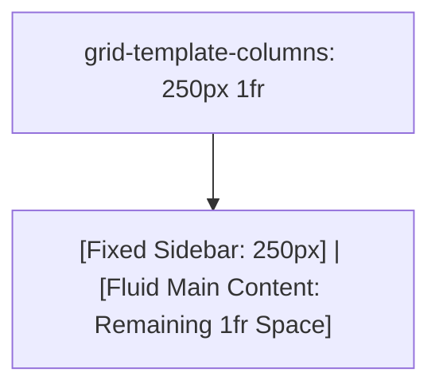

# Grid Template Columns

Estimated Reading Time: 12 minutes

Prerequisites: [CSS Grid](37-css-grid.md)

Learning Objectives:
- Master the `grid-template-columns` property.
- Understand track sizing units: `px`, `%`, `fr`, `auto`, and `minmax()`.
- Use the `repeat()` function for clean track declarations.
- Build responsive multi-column layouts.

---

## Introduction

The `grid-template-columns` property defines the number and widths of vertical column tracks inside a CSS Grid container.

By listing space-separated track size values, developers can construct fixed sidebar and fluid main content layouts (e.g. `250px 1fr`), 3-column equal cards (`repeat(3, 1fr)`), or responsive auto-wrapping grids (`repeat(auto-fit, minmax(200px, 1fr))`).

---

## Real-World Analogy

Imagine building a shelving unit with vertical divider panels.

- **`250px 1fr`**: Installing a narrow fixed 250mm compartment for tools on the left, and letting the main storage compartment expand to fill whatever remaining space is left on the shelf.
- **`repeat(3, 1fr)`**: Installing 2 vertical dividers to split the shelf into 3 completely equal compartment slots.

`grid-template-columns` establishes column width blueprints.

---

## Core Concepts

### 1. Fractional Unit (`fr`)
Distributes available free space proportionally:
- `1fr 1fr 1fr`: 3 equal columns.
- `250px 1fr`: 250px fixed left column, remaining space assigned to right column.

### 2. The `repeat()` Function
Simplifies repetitive column definitions:
- `repeat(4, 1fr)` = `1fr 1fr 1fr 1fr`.

### 3. The `minmax()` Function
Defines a dynamic size range with minimum and maximum boundaries:
- `minmax(200px, 1fr)`: Column never shrinks smaller than 200px, but expands up to 1fr.

---

## Syntax

```css
/* 1. Fixed Sidebar + Fluid Content */
.dashboard-grid {
    display: grid;
    grid-template-columns: 260px 1fr;
}

/* 2. Equal 3-Column Grid */
.cards-grid {
    display: grid;
    grid-template-columns: repeat(3, 1fr);
}

/* 3. Auto-Responsive Grid */
.responsive-grid {
    display: grid;
    grid-template-columns: repeat(auto-fit, minmax(240px, 1fr));
}
```

---

## Property Reference

| Syntax Pattern | Column Blueprint Result | Example Use Case |
| :--- | :--- | :--- |
| `250px 1fr` | Fixed 250px column + 1 flexible column | Dashboard sidebar + main area |
| `repeat(3, 1fr)` | 3 completely equal flexible columns | 3-card feature section |
| `1fr 2fr 1fr` | Center column is twice as wide as sides | Featured middle article |
| `repeat(auto-fit, minmax(200px, 1fr))` | Auto-wrapping responsive grid | Product catalog grids |

---

## Visual Explanation



---

## Example 1

### HTML
```html
<!DOCTYPE html>
<html lang="en">
<head>
    <meta charset="UTF-8">
    <title>Sidebar + Main Layout Grid</title>
    <style>
        body { font-family: Arial, sans-serif; margin: 0; background-color: #f8fafc; }
        
        .app-layout {
            display: grid;
            grid-template-columns: 240px 1fr;
            min-height: 100vh;
        }
        
        .sidebar {
            background-color: #0f172a;
            color: white;
            padding: 20px;
        }
        
        .main-content {
            padding: 30px;
        }
    </style>
</head>
<body>
    <div class="app-layout">
        <div class="sidebar">
            <h3>Sidebar Nav</h3>
            <p>Fixed 240px width.</p>
        </div>
        <div class="main-content">
            <h2>Main Dashboard</h2>
            <p>Expands fluidly (1fr) to fill remaining viewport width.</p>
        </div>
    </div>
</body>
</html>
```

### CSS
```css
.app-layout {
    display: grid;
    grid-template-columns: 240px 1fr;
}
```

### Explanation
`grid-template-columns: 240px 1fr` locks the sidebar to 240px fixed width, while allowing main content to expand fluidly (`1fr`).

---

## Output Image Prompt

A browser window showing a web app layout. On the left, a dark slate vertical sidebar measures 240px wide. On the right, light main dashboard content expands to fill remaining screen width.

---

## Code Explanation

- `grid-template-columns: 240px 1fr;`: Allocates 240px to column 1 and remaining free space to column 2.

---

## Example 2

### HTML
```html
<!DOCTYPE html>
<html lang="en">
<head>
    <meta charset="UTF-8">
    <title>Media-Query-Free Responsive Grid</title>
    <style>
        body { font-family: Arial, sans-serif; padding: 20px; }
        
        .card-grid {
            display: grid;
            grid-template-columns: repeat(auto-fit, minmax(220px, 1fr));
            gap: 20px;
        }
        
        .card {
            background-color: #2563eb;
            color: white;
            padding: 25px;
            border-radius: 8px;
            text-align: center;
        }
    </style>
</head>
<body>
    <div class="card-grid">
        <div class="card">Card 1</div>
        <div class="card">Card 2</div>
        <div class="card">Card 3</div>
        <div class="card">Card 4</div>
    </div>
</body>
</html>
```

### CSS
```css
.card-grid {
    display: grid;
    grid-template-columns: repeat(auto-fit, minmax(220px, 1fr));
    gap: 20px;
}
```

### Explanation
`repeat(auto-fit, minmax(220px, 1fr))` creates a responsive card grid that wraps columns automatically when screen width drops below 220px per card.

---

## Output Image Prompt

A browser window showing 4 blue cards that adjust column count automatically as screen width changes.

---

## Code Explanation

- `repeat(auto-fit, minmax(220px, 1fr))`: Creates auto-wrapping responsive grid tracks.

---

## Best Practices

- **Use `250px 1fr` for Dashboards**: Combine fixed sidebars with fluid main content for web app dashboards.
- **Use `repeat(auto-fit, minmax())` for Cards**: Build responsive card grids without writing media queries.

---

## Common Mistakes

### Mistake 1: Hardcoding All Column Widths in Fixed Pixels

```css
/* INCORRECT */
.grid {
    display: grid;
    grid-template-columns: 400px 400px 400px; /* Causes horizontal scrollbars on screens < 1200px! */
}
```

#### Explanation
Fixed pixel column grids break mobile screen responsiveness.

```css
/* CORRECT */
.grid {
    display: grid;
    grid-template-columns: repeat(3, 1fr);
}
```

---

## Browser Compatibility

`grid-template-columns` and functions (`repeat()`, `minmax()`, `auto-fit`, `fr`) have 100% universal support across all desktop and mobile browsers.

---

## Real-World Applications

- **SaaS Dashboard Layouts**: `260px 1fr` sidebar layouts.
- **E-Commerce Product Catalogs**: `repeat(auto-fit, minmax(240px, 1fr))`.
- **3-Column Feature Cards**: `repeat(3, 1fr)`.

---

## Mini Project

### Project Objective: Responsive Dashboard Layout
Build a web app dashboard layout with a `240px 1fr` sidebar and main content section.

---

## Practice Exercises

### Beginner Level
1. Create 3 equal columns using `grid-template-columns: 1fr 1fr 1fr;`.
2. Use `repeat(4, 1fr)` to create 4 equal columns.
3. Build a sidebar grid using `200px 1fr`.
4. Mix pixels and fractions (`300px 1fr 200px`).
5. Add 20px column gap spacing.

### Intermediate Level
6. Create an auto-responsive grid using `repeat(auto-fit, minmax(200px, 1fr))`.
7. Compare `auto-fit` vs `auto-fill`.
8. Create a 3-column layout where middle column is twice as wide (`1fr 2fr 1fr`).
9. Use `minmax(150px, 300px)` on a column track.
10. Combine `grid-template-columns` with media queries.

### Advanced Level
11. Audit sub-pixel track width calculation algorithms across browsers.
12. Combine `grid-template-columns` with CSS custom properties.
13. Build an asymmetric editorial magazine grid using fractional units.
14. Optimize reflow performance during dynamic track resizing.
15. Solve mobile Safari grid track calculation bugs.

---

## Quick Quiz

**1. What property defines vertical column tracks in CSS Grid?**
A) `grid-template-columns`  
B) `grid-template-rows`  

**2. What does `1fr` represent?**
A) 1 fraction of available free space  
B) 1 fixed pixel  

**3. What does `repeat(3, 1fr)` generate?**
A) 3 equal columns  
B) 1 column repeated 3 times vertically  

**4. What function defines minimum and maximum size boundaries for a grid column?**
A) `minmax(min, max)`  
B) `clamp()`  

**5. What blueprint creates a fixed 250px sidebar and fluid main content?**
A) `grid-template-columns: 250px 1fr`  
B) `grid-template-columns: 50% 50%`  

**6. What keyword wraps columns automatically when space runs out?**
A) `auto-fit`  
B) `wrap`  

**7. How many equal columns does `repeat(12, 1fr)` create?**
A) 12 columns  
B) 2 columns  

**8. Can fixed units (`px`) and fluid units (`fr`) be combined in `grid-template-columns`?**
A) Yes  
B) No  

**9. What happens if total column width exceeds container width?**
A) Horizontal scrollbar appears  
B) Grid deletes excess items  

**10. What property sets horizontal column gaps?**
A) `column-gap`  
B) `row-gap`  

---

### Answers
1: A | 2: A | 3: A | 4: A | 5: A | 6: A | 7: A | 8: A | 9: A | 10: A

---

## Interview Questions

**1. What is the `grid-template-columns` property?**  
*Answer:* `grid-template-columns` defines the number, sizing blueprint, and track units (`px`, `%`, `fr`, `auto`, `minmax()`) of vertical column tracks in a CSS Grid container.

**2. Explain `repeat(auto-fit, minmax(200px, 1fr))`.**  
*Answer:* This pattern creates an auto-responsive grid. `minmax(200px, 1fr)` ensures columns never shrink below 200px but grow to fill available space. `auto-fit` automatically calculates how many 200px columns fit per row, wrapping excess items without media queries.

**3. What is the advantage of the fractional (`fr`) unit over percentages (`%`)?**  
*Answer:* Percentages do not automatically account for grid `gap` gutters, causing row total overruns. The `fr` unit calculates free space **after** grid gaps and fixed tracks are deducted, preventing overflow layout bugs.

---

## Summary

- Use **`grid-template-columns`** for column blueprints.
- **`250px 1fr`**: Fixed sidebar + fluid main content.
- **`repeat(3, 1fr)`**: 3 equal columns.
- **`repeat(auto-fit, minmax(220px, 1fr))`**: Auto-responsive cards.

---

## Cheat Sheet

```css
/* SIDEBAR + MAIN LAYOUT */
.dashboard {
    display: grid;
    grid-template-columns: 250px 1fr;
}

/* 3-COLUMN EQUAL GRID */
.cards {
    display: grid;
    grid-template-columns: repeat(3, 1fr);
    gap: 20px;
}

/* AUTO-RESPONSIVE GRID */
.responsive-cards {
    display: grid;
    grid-template-columns: repeat(auto-fit, minmax(220px, 1fr));
    gap: 20px;
}
```

---

## Related Topics

- **Previous Topic**: [CSS Grid](37-css-grid.md)
- **Next Topic**: [Grid Template Rows](39-grid-template-rows.md)
- **Recommended Learning Order**: Introduction to CSS -> Ways to Add CSS -> CSS Selectors -> CSS Colors -> CSS Fonts -> CSS Borders -> Border Radius -> CSS Shadows -> CSS Margins -> CSS Padding -> CSS Width -> CSS Height -> CSS Box Model -> CSS Float -> CSS Overflow -> CSS Display -> CSS Position -> CSS Background Images -> CSS Background Properties -> CSS Combinators -> CSS Pseudo Classes -> CSS Pseudo Elements -> CSS Pagination -> CSS Dropdown Menu -> CSS Navigation Bar -> Responsive Web Design -> Media Queries -> CSS Flexbox -> Flex Direction -> Justify Content -> Align Items -> Align Self -> Flex Wrap -> Gap -> Order -> CSS Grid -> Grid Template Columns -> Grid Template Rows
