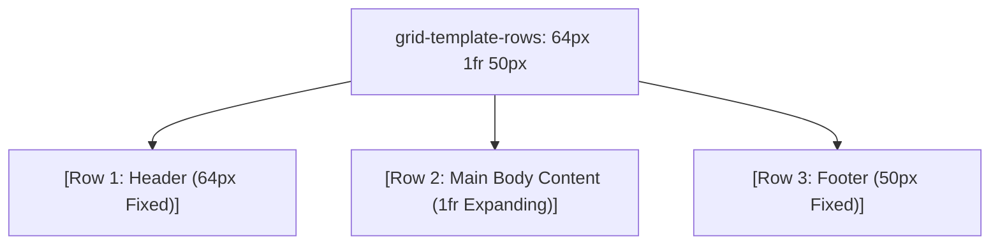

# Grid Template Rows

Estimated Reading Time: 12 minutes

Prerequisites: [CSS Grid](37-css-grid.md), [Grid Template Columns](38-grid-template-columns.md)

Learning Objectives:
- Master the `grid-template-rows` property.
- Understand explicit vs implicit grid rows (`grid-auto-rows`).
- Define fixed, fluid, and auto-height row track patterns.
- Build full-height page layouts with sticky footers.

---

## Introduction

The `grid-template-rows` property defines the number and height dimensions of horizontal row tracks inside a CSS Grid container.

While `grid-template-columns` handles vertical column width blueprints, `grid-template-rows` manages horizontal height layouts—such as building 3-row page templates featuring a fixed header (`64px`), a flexible content area (`1fr`), and a fixed footer (`50px`).

---

## Real-World Analogy

Imagine building a multi-story apartment building.

- **`60px 1fr 40px`**: Setting a fixed 60mm ground floor entrance lobby height, a 40mm roof terrace height, and allowing the middle apartment floors (`1fr`) to expand and shrink dynamically depending on total building height.

`grid-template-rows` establishes horizontal row height blueprints.

---

## Core Concepts

### 1. Explicit Grid Rows
Explicit rows defined directly via `grid-template-rows`:
- `grid-template-rows: 64px 1fr 50px;` (Header, Main Body, Footer).

### 2. Implicit Grid Rows (`grid-auto-rows`)
When more items exist than defined explicit rows, CSS Grid automatically generates implicit rows. Their height is controlled via `grid-auto-rows`:
- `grid-auto-rows: 200px;` or `grid-auto-rows: minmax(100px, auto);`.

### 3. Track Units
- `px`: Fixed height rows (`60px`).
- `auto`: Height adapts to inner text content.
- `1fr`: Row expands to fill remaining vertical container space.

---

## Syntax

```css
/* 1. Header + Content + Footer Page Layout */
.app-viewport {
    display: grid;
    grid-template-rows: 64px 1fr 50px;
    min-height: 100vh;
}

/* 2. Equal Height 3-Row Grid */
.equal-rows {
    display: grid;
    grid-template-rows: repeat(3, 1fr);
    height: 600px;
}

/* 3. Implicit Row Fallback */
.grid-container {
    display: grid;
    grid-template-columns: repeat(3, 1fr);
    grid-auto-rows: minmax(150px, auto); /* Height for dynamically added rows */
}
```

---

## Property Reference

| Syntax Pattern | Row Blueprint Result | Example Use Case |
| :--- | :--- | :--- |
| `64px 1fr 50px` | Fixed Header + Fluid Main Body + Fixed Footer | Full-viewport application layout |
| `repeat(3, 1fr)` | 3 equal height horizontal rows | Equal height card sections |
| `auto 1fr` | Auto content height + expanding bottom section | Form and card components |
| `grid-auto-rows: 200px` | Dynamically created implicit rows get 200px height | Infinite scrolling feeds |

---

## Visual Explanation



---

## Example 1

### HTML
```html
<!DOCTYPE html>
<html lang="en">
<head>
    <meta charset="UTF-8">
    <title>Full-Height Page App Layout</title>
    <style>
        body { margin: 0; font-family: Arial, sans-serif; }
        
        .page-layout {
            display: grid;
            grid-template-rows: 60px 1fr 40px;
            min-height: 100vh;
        }
        
        .header { background-color: #0f172a; color: white; padding: 0 20px; display: flex; align-items: center; }
        .main { background-color: #f8fafc; padding: 30px; }
        .footer { background-color: #cbd5e1; color: #0f172a; padding: 0 20px; display: flex; align-items: center; font-size: 14px; }
    </style>
</head>
<body>
    <div class="page-layout">
        <header class="header">Header Bar (60px)</header>
        <main class="main">
            <h2>Main Viewport Content Area</h2>
            <p>This middle row expands (1fr) to fill all available vertical space, pushing the footer cleanly to the bottom of the screen.</p>
        </main>
        <footer class="footer">Footer Bar (40px)</footer>
    </div>
</body>
</html>
```

### CSS
```css
.page-layout {
    display: grid;
    grid-template-rows: 60px 1fr 40px;
    min-height: 100vh;
}
```

### Explanation
`grid-template-rows: 60px 1fr 40px` creates a classic 3-row application layout. The middle row (`1fr`) expands vertically to push the footer flush to the bottom of the viewport screen without JavaScript.

---

## Output Image Prompt

A browser window showing a full-screen app layout. A dark header rests at the top (60px), a light gray content area fills the middle screen, and a slate footer bar rests flush at the bottom (40px).

---

## Code Explanation

- `min-height: 100vh;`: Sets container height to fill full screen viewport.
- `grid-template-rows: 60px 1fr 40px;`: Fixes top header to 60px, bottom footer to 40px, and expands middle main body to fill remaining space.

---

## Example 2

### HTML
```html
<!DOCTYPE html>
<html lang="en">
<head>
    <meta charset="UTF-8">
    <title>Implicit Row Auto Sizing</title>
    <style>
        body { font-family: Arial, sans-serif; padding: 20px; }
        
        .feed-grid {
            display: grid;
            grid-template-columns: repeat(2, 1fr);
            grid-auto-rows: minmax(120px, auto);
            gap: 15px;
        }
        
        .feed-item {
            background-color: #2563eb;
            color: white;
            padding: 20px;
            border-radius: 8px;
        }
    </style>
</head>
<body>
    <div class="feed-grid">
        <div class="feed-item">Item 1</div>
        <div class="feed-item">Item 2</div>
        <div class="feed-item">Item 3</div>
        <div class="feed-item">Item 4</div>
    </div>
</body>
</html>
```

### CSS
```css
.feed-grid {
    display: grid;
    grid-template-columns: repeat(2, 1fr);
    grid-auto-rows: minmax(120px, auto);
    gap: 15px;
}
```

### Explanation
`grid-auto-rows: minmax(120px, auto)` automatically formats dynamically generated rows to a minimum height of 120px, expanding if content grows longer.

---

## Output Image Prompt

A browser window showing 4 blue grid cards arranged in 2 columns and 2 rows with 120px minimum row heights.

---

## Code Explanation

- `grid-auto-rows: minmax(120px, auto);`: Automatically formats implicit row heights to at least 120px.

---

## Best Practices

- **Use `60px 1fr 40px` for Page Layouts**: Combine `min-height: 100vh` with `grid-template-rows: auto 1fr auto` for sticky footers.
- **Use `grid-auto-rows` for Dynamic Data**: Use `grid-auto-rows: minmax(150px, auto)` for dynamic content feeds to prevent text overflow.

---

## Common Mistakes

### Mistake 1: Hardcoding Fixed Pixel Heights on All Rows

```css
/* INCORRECT */
.layout {
    display: grid;
    grid-template-rows: 60px 500px 40px; /* Fixed 500px row cuts off text on small screens or leaves white gap on 4K screens! */
}
```

#### Explanation
Fixed pixel row heights break responsive vertical scaling. Use `1fr` or `auto`.

```css
/* CORRECT */
.layout {
    display: grid;
    grid-template-rows: 60px 1fr 40px;
}
```

---

## Browser Compatibility

`grid-template-rows` and `grid-auto-rows` have 100% universal support across all desktop and mobile browsers.

---

## Real-World Applications

- **Full-Screen App Viewports**: Header, Main Content, Footer (`auto 1fr auto`).
- **Dashboard Sidebar Widgets**: Top user info, middle scrollable links, bottom logout link.
- **Dynamic Content Feeds**: `grid-auto-rows: minmax(100px, auto)`.

---

## Mini Project

### Project Objective: Full-Viewport Page Layout
Build a full-viewport web page layout using `grid-template-rows: 60px 1fr 40px` and `min-height: 100vh`.

---

## Practice Exercises

### Beginner Level
1. Define 3 equal rows using `grid-template-rows: 1fr 1fr 1fr;`.
2. Build a page layout using `grid-template-rows: 60px 1fr 40px;`.
3. Use `repeat(3, 100px)` for fixed height rows.
4. Set explicit height on grid container (`height: 500px`).
5. Add row gaps using `row-gap: 20px;`.

### Intermediate Level
6. Set implicit row heights using `grid-auto-rows: 150px`.
7. Combine `minmax(100px, auto)` on dynamic row tracks.
8. Align items vertically inside row tracks using `align-content: space-between`.
9. Create a 2-row card layout with auto header and expanding body.
10. Combine `grid-template-rows` with `grid-template-columns`.

### Advanced Level
11. Audit performance costs of dynamic row recalculations during infinite scroll.
12. Combine `grid-template-rows` with CSS custom properties.
13. Build a complex web app layout with nested row grids.
14. Optimize track sizing engine performance on mobile devices.
15. Solve mobile Safari full-screen height jump bugs using `dvh` units.

---

## Quick Quiz

**1. What CSS property defines horizontal row tracks in CSS Grid?**
A) `grid-template-rows`  
B) `grid-template-columns`  

**2. What blueprint creates a fixed 60px header, expanding main area, and 40px footer?**
A) `grid-template-rows: 60px 1fr 40px`  
B) `grid-template-rows: 1fr 1fr 1fr`  

**3. What property sets height dimensions for dynamically generated implicit rows?**
A) `grid-auto-rows`  
B) `grid-row-height`  

**4. What happens if middle row height is set to `1fr` inside a `100vh` container?**
A) It expands to consume all remaining vertical space  
B) It collapses to 0px  

**5. What property sets vertical line spacing between rows?**
A) `row-gap`  
B) `column-gap`  

**6. What value makes a row track adapt dynamically to inner text height?**
A) `auto`  
B) `100px`  

**7. Does `repeat(3, 1fr)` work for `grid-template-rows`?**
A) Yes  
B) No  

**8. What unit is used for flexible fractional vertical space?**
A) `fr`  
B) `px`  

**9. What container property is paired with `grid-template-rows: 60px 1fr 40px` for full-screen web apps?**
A) `min-height: 100vh`  
B) `width: 100%`  

**10. What function guarantees a minimum row height while allowing content expansion?**
A) `minmax(min, auto)`  
B) `clamp()`  

---

### Answers
1: A | 2: A | 3: A | 4: A | 5: A | 6: A | 7: A | 8: A | 9: A | 10: A

---

## Interview Questions

**1. What is the `grid-template-rows` property in CSS Grid?**  
*Answer:* `grid-template-rows` defines the number, height dimensions, and track units (`px`, `fr`, `auto`, `minmax()`) of horizontal row tracks in a CSS Grid container.

**2. What is the difference between explicit rows and implicit rows?**  
*Answer:* Explicit rows are defined directly via `grid-template-rows`. Implicit rows are generated automatically by the browser when content items exceed explicit row counts; their height is controlled via `grid-auto-rows`.

**3. How do you create a full-viewport web application layout with a sticky footer using CSS Grid?**  
*Answer:* Set the container to `display: grid; min-height: 100vh; grid-template-rows: auto 1fr auto;`. The middle `1fr` row expands vertically, pushing the footer flush to the bottom of the screen.

---

## Summary

- Use **`grid-template-rows`** for row height blueprints.
- **`60px 1fr 40px`**: Full-screen Header/Main/Footer layout.
- Use **`grid-auto-rows: minmax(100px, auto)`** for dynamic rows.

---

## Cheat Sheet

```css
/* FULL-VIEWPORT APP LAYOUT */
.app-container {
    display: grid;
    grid-template-rows: 60px 1fr 40px;
    min-height: 100vh;
}

/* DYNAMIC IMPLICIT ROWS */
.feed {
    display: grid;
    grid-template-columns: repeat(2, 1fr);
    grid-auto-rows: minmax(150px, auto);
    gap: 20px;
}
```

---

## Related Topics

- **Previous Topic**: [Grid Template Columns](38-grid-template-columns.md)
- **Next Topic**: [CSS Transitions](40-css-transitions.md)
- **Recommended Learning Order**: Introduction to CSS -> Ways to Add CSS -> CSS Selectors -> CSS Colors -> CSS Fonts -> CSS Borders -> Border Radius -> CSS Shadows -> CSS Margins -> CSS Padding -> CSS Width -> CSS Height -> CSS Box Model -> CSS Float -> CSS Overflow -> CSS Display -> CSS Position -> CSS Background Images -> CSS Background Properties -> CSS Combinators -> CSS Pseudo Classes -> CSS Pseudo Elements -> CSS Pagination -> CSS Dropdown Menu -> CSS Navigation Bar -> Responsive Web Design -> Media Queries -> CSS Flexbox -> Flex Direction -> Justify Content -> Align Items -> Align Self -> Flex Wrap -> Gap -> Order -> CSS Grid -> Grid Template Columns -> Grid Template Rows -> CSS Transitions
