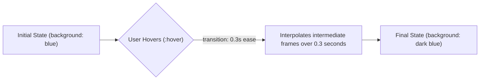

# CSS Transitions

Estimated Reading Time: 15 minutes

Prerequisites: [CSS Pseudo Classes](22-css-pseudo-classes.md)

Learning Objectives:
- Master the `transition` shorthand and sub-properties (`transition-property`, `transition-duration`, `transition-timing-function`, `transition-delay`).
- Understand easing functions (`ease`, `linear`, `ease-in-out`, `cubic-bezier`).
- Create smooth UI state changes (`:hover`, `:focus`, `:active`).
- Identify GPU-accelerated animatable properties (`opacity`, `transform`).

---

## Introduction

**CSS Transitions** allow property changes in CSS to occur smoothly over a specified duration rather than instantaneously.

When a user hovers over a button, focuses an input field, or toggles a dropdown menu, CSS transitions interpolate intermediate values between the starting state and ending state—creating smooth visual feedback for enhanced user experience.

---

## Real-World Analogy

Imagine a light switch vs a dimmer knob.

- **Without Transitions (Instant)**: A standard light switch. You flip the switch, and the room instantly snaps from pitch black to blinding light in 0 seconds.
- **With CSS Transitions (Smooth)**: A rotary dimmer knob. As you turn the dial, light intensity glides smoothly over 0.3 seconds from dark to warm brightness.

Transitions smooth out UI state changes.

---

## Core Concepts

### 1. The 4 Transition Sub-Properties
- `transition-property`: Property to animate (`background-color`, `transform`, `all`).
- `transition-duration`: Animation time (`0.3s`, `300ms`).
- `transition-timing-function`: Acceleration curve (`ease`, `linear`, `ease-in-out`).
- `transition-delay`: Wait time before animation starts (`0.1s`).

### 2. Shorthand Syntax
`transition: property duration timing-function delay;`
- Example: `transition: background-color 0.3s ease 0s;`

### 3. GPU-Accelerated Animatable Properties
For 60fps performance, animate hardware-accelerated properties:
- **Fast / GPU-Accelerated**: `transform` (scale, translate, rotate), `opacity`.
- **Slower (Triggers Layout Reflow)**: `width`, `height`, `margin`, `padding`, `top`, `left`.

---

## Syntax

```css
/* Individual Sub-Properties */
.button {
    background-color: #2563eb;
    transition-property: background-color, transform;
    transition-duration: 0.3s;
    transition-timing-function: ease;
    transition-delay: 0s;
}

/* Complete Shorthand Syntax */
/* transition: <property> <duration> <timing-function> <delay>; */
.button-shorthand {
    background-color: #2563eb;
    transition: all 0.3s ease-in-out;
}

.button-shorthand:hover {
    background-color: #1d4ed8;
    transform: translateY(-2px);
}
```

---

## Property Reference

| Sub-Property | Purpose | Example Values | Default |
| :--- | :--- | :--- | :--- |
| `transition-property` | CSS property to transition | `background-color`, `transform`, `all` | `all` |
| `transition-duration` | Time duration of transition | `0.3s`, `300ms` | `0s` (Instant) |
| `transition-timing-function` | Speed curve acceleration | `ease`, `linear`, `ease-in-out` | `ease` |
| `transition-delay` | Delay before transition begins | `0.1s`, `100ms` | `0s` |

---

## Visual Explanation



---

## Example 1

### HTML
```html
<!DOCTYPE html>
<html lang="en">
<head>
    <meta charset="UTF-8">
    <title>Smooth Hover Button</title>
    <style>
        body { font-family: Arial, sans-serif; padding: 40px; }
        
        .btn-smooth {
            background-color: #2563eb;
            color: #ffffff;
            padding: 12px 24px;
            border: none;
            border-radius: 6px;
            font-size: 16px;
            font-weight: bold;
            cursor: pointer;
            
            /* Smooth Transition */
            transition: background-color 0.3s ease, transform 0.2s ease;
        }
        
        .btn-smooth:hover {
            background-color: #1d4ed8;
            transform: translateY(-3px);
            box-shadow: 0 10px 15px -3px rgba(37, 99, 235, 0.3);
        }
    </style>
</head>
<body>
    <button class="btn-smooth">Hover Over Me</button>
</body>
</html>
```

### CSS
```css
.btn-smooth {
    background-color: #2563eb;
    transition: background-color 0.3s ease, transform 0.2s ease;
}
.btn-smooth:hover {
    background-color: #1d4ed8;
    transform: translateY(-3px);
}
```

### Explanation
Moving the mouse over `.btn-smooth` smoothly transitions background color and lifts the button 3px upward over 0.3 seconds.

---

## Output Image Prompt

A browser window showing a blue button rising smoothly with a soft shadow under the mouse cursor.

---

## Code Explanation

- `transition: background-color 0.3s ease, transform 0.2s ease;`: Declares independent durations and acceleration curves for background color and lift transform.

---

## Example 2

### HTML
```html
<!DOCTYPE html>
<html lang="en">
<head>
    <meta charset="UTF-8">
    <title>Card Scale Hover Effect</title>
    <style>
        body { font-family: Arial, sans-serif; padding: 30px; background-color: #f8fafc; }
        
        .card {
            width: 260px;
            background-color: #ffffff;
            border: 1px solid #cbd5e1;
            padding: 20px;
            border-radius: 8px;
            
            /* GPU Accelerated Scale Transition */
            transition: transform 0.3s cubic-bezier(0.34, 1.56, 0.64, 1);
        }
        
        .card:hover {
            transform: scale(1.04);
        }
    </style>
</head>
<body>
    <div class="card">
        <h3 style="margin-top:0;">Interactive Card</h3>
        <p style="margin:0; color:#64748b;">Scales smoothly with a slight spring cubic-bezier easing curve on hover.</p>
    </div>
</body>
</html>
```

### CSS
```css
.card {
    transition: transform 0.3s cubic-bezier(0.34, 1.56, 0.64, 1);
}
.card:hover {
    transform: scale(1.04);
}
```

### Explanation
`cubic-bezier(0.34, 1.56, 0.64, 1)` applies a springy bounce easing curve to the card's hover scaling transition.

---

## Output Image Prompt

A browser window showing a card scaling up slightly with a springy animated feel on hover.

---

## Code Explanation

- `cubic-bezier(...)`: Custom easing curve creating a spring bounce effect.

---

## Best Practices

- **Animate `transform` and `opacity`**: Prioritize `transform` and `opacity` for 60fps animations.
- **Declare `transition` on Base Class, Not `:hover`**: Declare `transition` on `.button`, not `.button:hover`, so transitions run smoothly in both hover-on and hover-off directions.

---

## Common Mistakes

### Mistake 1: Declaring `transition` Inside `:hover` Selector Only

```css
/* INCORRECT */
.button { background-color: blue; }
.button:hover {
    background-color: darkblue;
    transition: background-color 0.3s; /* Transition runs on hover-on, but SNAPS instantly on hover-off! */
}
```

#### Explanation
If declared only on `:hover`, the hover-off transition snaps instantly.

```css
/* CORRECT */
.button {
    background-color: blue;
    transition: background-color 0.3s; /* Smooth in BOTH directions */
}
.button:hover { background-color: darkblue; }
```

---

## Browser Compatibility

CSS Transitions have 100% universal support across all desktop and mobile browsers.

---

## Real-World Applications

- **Interactive Buttons**: Hover background colors and lift effects.
- **Card Zoom Effects**: Hover scaling on e-commerce product cards.
- **Accordion Toggles**: Smooth height/opacity dropdown transitions.

---

## Mini Project

### Project Objective: Interactive Hover Card Component
Build a card component that scales, shifts shadow, and darkens text smoothly on hover.

---

## Practice Exercises

### Beginner Level
1. Add a 0.3s background color transition to a button (`transition: background-color 0.3s;`).
2. Transition text color on link hover.
3. Apply `transition: all 0.2s ease;` to a card.
4. Scale an image on hover using `transform: scale(1.05);` with transition.
5. Fade element opacity from `0.5` to `1` over 0.4s.

### Intermediate Level
6. Explain why `transition` should be declared on the base class instead of `:hover`.
7. Animate a button lift using `transform: translateY(-4px)`.
8. Create a spring bounce effect using `cubic-bezier()`.
9. Add a 0.1s delay to a transition using `transition-delay: 0.1s`.
10. Combine independent transitions for `background-color` and `transform`.

### Advanced Level
11. Compare performance of animating `transform: translateX()` vs `left`.
12. Respect user motion preferences using `@media (prefers-reduced-motion: reduce)`.
13. Build a CSS hamburger icon animation transitioning to an 'X' icon.
14. Audit GPU paint layer promotion triggered by `will-change: transform`.
15. Solve mobile Safari hover persistence bugs.

---

## Quick Quiz

**1. What CSS property creates smooth state change animations over time?**
A) `transition`  
B) `animation`  

**2. Where should the `transition` property be declared for smooth two-way animations?**
A) On the base element class (`.button`)  
B) Inside `:hover` state only  

**3. Which properties are GPU-accelerated for 60fps performance?**
A) `transform` and `opacity`  
B) `width` and `height`  

**4. What default timing function provides a smooth start and slow end?**
A) `ease`  
B) `linear`  

**5. What shorthand parameter specifies wait time before animation starts?**
A) `transition-delay`  
B) `transition-duration`  

**6. What property value transitions all animatable properties?**
A) `all`  
B) `every`  

**7. Which timing function maintains a constant speed from start to end?**
A) `linear`  
B) `ease-in`  

**8. What function creates custom bezier acceleration curves?**
A) `cubic-bezier()`  
B) `curve()`  

**9. What unit expresses transition duration?**
A) `s` or `ms`  
B) `px`  

**10. What media query disables transitions for users sensitive to motion?**
A) `@media (prefers-reduced-motion: reduce)`  
B) `@media (no-motion)`  

---

### Answers
1: A | 2: A | 3: A | 4: A | 5: A | 6: A | 7: A | 8: A | 9: A | 10: A

---

## Interview Questions

**1. What are CSS Transitions?**  
*Answer:* CSS Transitions allow property changes to occur smoothly over a specified duration rather than instantaneously, interpolating intermediate frame values between initial and hover/active states.

**2. Why should developers animate `transform` and `opacity` instead of `width`, `height`, or `top`?**  
*Answer:* `transform` and `opacity` are hardware-accelerated by the GPU, executing entirely on the Compositor thread without triggering costly Layout reflows or Paint operations, guaranteeing 60fps performance.

**3. Why must `transition` be declared on the base selector instead of `:hover`?**  
*Answer:* Declaring `transition` on the base class ensures the smooth animation runs in both directions (when mouse enters AND when mouse leaves). Declaring it inside `:hover` causes the exit animation to snap abruptly.

---

## Summary

- Declare **`transition`** on base element classes.
- Animate **`transform`** and **`opacity`** for 60fps performance.
- Syntax: **`transition: property duration timing delay;`**.

---

## Cheat Sheet

```css
/* SMOOTH HOVER BUTTON PATTERN */
.btn {
    background-color: #2563eb;
    transition: background-color 0.3s ease, transform 0.2s ease;
}

.btn:hover {
    background-color: #1d4ed8;
    transform: translateY(-2px);
}
```

---

## Related Topics

- **Previous Topic**: [Grid Template Rows](39-grid-template-rows.md)
- **Next Topic**: [CSS Animations](41-css-animations.md)
- **Recommended Learning Order**: Introduction to CSS -> Ways to Add CSS -> CSS Selectors -> CSS Colors -> CSS Fonts -> CSS Borders -> Border Radius -> CSS Shadows -> CSS Margins -> CSS Padding -> CSS Width -> CSS Height -> CSS Box Model -> CSS Float -> CSS Overflow -> CSS Display -> CSS Position -> CSS Background Images -> CSS Background Properties -> CSS Combinators -> CSS Pseudo Classes -> CSS Pseudo Elements -> CSS Pagination -> CSS Dropdown Menu -> CSS Navigation Bar -> Responsive Web Design -> Media Queries -> CSS Flexbox -> Flex Direction -> Justify Content -> Align Items -> Align Self -> Flex Wrap -> Gap -> Order -> CSS Grid -> Grid Template Columns -> Grid Template Rows -> CSS Transitions -> CSS Animations
