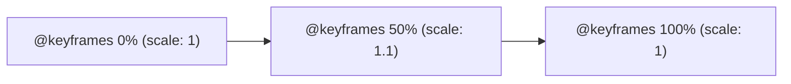

# CSS Animations

Estimated Reading Time: 15 minutes

Prerequisites: [CSS Transitions](40-css-transitions.md)

Learning Objectives:
- Master `@keyframes` keyframe animation rules.
- Understand `animation` shorthand and sub-properties (`animation-name`, `animation-duration`, `animation-iteration-count`, `animation-direction`, `animation-fill-mode`).
- Build looping loading spinners and pulse animations.
- Control animation play states (`running`, `paused`).

---

## Introduction

While **CSS Transitions** require a trigger state change (`:hover`, `:focus`) to move from state A to state B, **CSS Animations** can run automatically on page load, loop infinitely, and navigate complex multi-step keyframe sequences using `@keyframes`.

CSS Animations allow developers to build loading spinners, pulsing notification badges, sliding notification banners, and subtle hero section entrance effects without relying on heavy JavaScript libraries.

---

## Real-World Analogy

Imagine a movie filmstrip projection.

- **`@keyframes`**: Individual frames printed on a filmstrip (Frame 0% = dark scene, Frame 50% = bright explosion, Frame 100% = clear sky).
- **`animation-duration`**: The speed of the projector motor (e.g., 2 seconds per loop).
- **`animation-iteration-count: infinite`**: Taping the filmstrip into a continuous loop that plays endlessly.

CSS Animations project multi-frame visual keyframe sequences.

---

## Core Concepts

### 1. Keyframes (`@keyframes`)
Specifies the animation sequence stages using percentage keyframe markers (`0%` to `100%` or `from` to `to`):
```css
@keyframes pulse {
    0% { transform: scale(1); opacity: 1; }
    50% { transform: scale(1.1); opacity: 0.8; }
    100% { transform: scale(1); opacity: 1; }
}
```

### 2. Animation Properties
- `animation-name`: Links to keyframe rule name.
- `animation-duration`: Duration of 1 loop (`1s`, `2000ms`).
- `animation-iteration-count`: Repetitions (`3`, `infinite`).
- `animation-direction`: Play direction (`normal`, `reverse`, `alternate`).
- `animation-fill-mode`: Style state after animation ends (`forwards`, `backwards`, `both`).

---

## Syntax

```css
/* 1. Define Keyframes */
@keyframes spin {
    0% { transform: rotate(0deg); }
    100% { transform: rotate(360deg); }
}

/* 2. Apply Animation to Element */
/* animation: <name> <duration> <timing-function> <delay> <iteration-count> <direction> <fill-mode>; */
.spinner {
    width: 40px;
    height: 40px;
    border: 4px solid #cbd5e1;
    border-top-color: #2563eb;
    border-radius: 50%;
    
    animation: spin 1s linear infinite;
}
```

---

## Property Reference

| Sub-Property | Purpose | Common Values | Default |
| :--- | :--- | :--- | :--- |
| `animation-name` | Links to `@keyframes` rule name | Identifiers (`spin`, `fade`) | `none` |
| `animation-duration` | Time duration of 1 loop | `1s`, `500ms` | `0s` |
| `animation-iteration-count` | How many times animation plays | `1`, `3`, `infinite` | `1` |
| `animation-direction` | Forward, backward, or alternating | `normal`, `alternate`, `reverse` | `normal` |
| `animation-fill-mode` | Styles applied before/after animation | `forwards`, `backwards`, `both` | `none` |
| `animation-play-state` | Play or pause animation | `running`, `paused` | `running` |

---

## Visual Explanation



---

## Example 1

### HTML
```html
<!DOCTYPE html>
<html lang="en">
<head>
    <meta charset="UTF-8">
    <title>CSS Loading Spinner</title>
    <style>
        body { display: flex; justify-content: center; align-items: center; min-height: 100vh; font-family: Arial, sans-serif; background-color: #f8fafc; }
        
        @keyframes spin {
            0% { transform: rotate(0deg); }
            100% { transform: rotate(360deg); }
        }
        
        .loading-spinner {
            width: 48px;
            height: 48px;
            border: 5px solid #e2e8f0;
            border-top-color: #2563eb;
            border-radius: 50%;
            animation: spin 0.8s linear infinite;
        }
    </style>
</head>
<body>
    <div class="loading-spinner"></div>
</body>
</html>
```

### CSS
```css
@keyframes spin {
    0% { transform: rotate(0deg); }
    100% { transform: rotate(360deg); }
}
.loading-spinner {
    border-top-color: #2563eb;
    border-radius: 50%;
    animation: spin 0.8s linear infinite;
}
```

### Explanation
`@keyframes spin` defines a 360-degree rotation sequence. Applying `animation: spin 0.8s linear infinite` creates an infinitely spinning circular loading indicator.

---

## Output Image Prompt

A browser window showing a blue and gray circular loading spinner ring animating in a smooth continuous 360-degree rotation loop.

---

## Code Explanation

- `@keyframes spin`: Defines 0 to 360-degree rotation sequence.
- `animation: spin 0.8s linear infinite`: Runs rotation keyframe continuously.

---

## Example 2

### HTML
```html
<!DOCTYPE html>
<html lang="en">
<head>
    <meta charset="UTF-8">
    <title>Fade In Slide Up Card</title>
    <style>
        body { font-family: Arial, sans-serif; padding: 40px; background-color: #f8fafc; }
        
        @keyframes fadeInUp {
            from {
                opacity: 0;
                transform: translateY(20px);
            }
            to {
                opacity: 1;
                transform: translateY(0);
            }
        }
        
        .card-entrance {
            width: 280px;
            background-color: #ffffff;
            border: 1px solid #cbd5e1;
            padding: 20px;
            border-radius: 8px;
            animation: fadeInUp 0.6s ease-out forwards;
        }
    </style>
</head>
<body>
    <div class="card-entrance">
        <h3 style="margin-top:0;">Entrance Card</h3>
        <p style="margin:0;">Fades in and slides upward on page load, retaining final opacity state via animation-fill-mode: forwards.</p>
    </div>
</body>
</html>
```

### CSS
```css
@keyframes fadeInUp {
    from { opacity: 0; transform: translateY(20px); }
    to { opacity: 1; transform: translateY(0); }
}
.card-entrance {
    animation: fadeInUp 0.6s ease-out forwards;
}
```

### Explanation
`fadeInUp` slides the card 20px upward while fading opacity to 1. `animation-fill-mode: forwards` keeps the card visible after the animation completes.

---

## Output Image Prompt

A browser window showing a white card fading into view while sliding slightly upward on page load.

---

## Code Explanation

- `animation-fill-mode: forwards`: Retains final keyframe state (`opacity: 1`) after animation ends.

---

## Best Practices

- **Use `animation-fill-mode: forwards` for Entrance Effects**: Retain end keyframe values so elements do not snap back to initial hidden states.
- **Animate Hardware-Accelerated Properties**: Use `transform` and `opacity` for smooth 60fps animations.

---

## Common Mistakes

### Mistake 1: Forgetting `animation-fill-mode: forwards`

```css
/* INCORRECT */
@keyframes fadeIn {
    from { opacity: 0; }
    to { opacity: 1; }
}
.box {
    animation: fadeIn 1s; /* Box fades in to 100%, then SNAPS BACK to opacity: 0 when finished! */
}
```

#### Explanation
Without `forwards`, elements reset to initial un-animated CSS states after keyframes finish.

```css
/* CORRECT */
.box {
    animation: fadeIn 1s forwards; /* Retains final opacity: 1 state */
}
```

---

## Browser Compatibility

CSS Animations and `@keyframes` have 100% universal support across all desktop and mobile browsers.

---

## Real-World Applications

- **Loading Spinners**: Infinite circular spinners.
- **Pulsing Badges**: Live notification indicators (`animation: pulse 1.5s infinite`).
- **Page Entrance Effects**: `fadeInUp` hero section animations.

---

## Mini Project

### Project Objective: Looping Pulse Badge & Spinner Component
Build a live indicator badge with a pulsing ring animation (`animation: pulse infinite`) and a loading spinner.

---

## Practice Exercises

### Beginner Level
1. Create a 360-degree rotation `@keyframes` rule.
2. Build an infinite spinning loader (`animation: spin 1s linear infinite;`).
3. Create a fade-in animation (`from { opacity: 0; } to { opacity: 1; }`).
4. Retain final animation state using `forwards`.
5. Pause an animation on hover using `animation-play-state: paused;`.

### Intermediate Level
6. Build a pulsing live status badge (`transform: scale(1.1)`).
7. Create a 3-step keyframe sequence (`0%`, `50%`, `100%`).
8. Reverse animation play direction using `animation-direction: alternate`.
9. Add a delay using `animation-delay: 0.5s`.
10. Combine `transform: translateY()` and `opacity` keyframes.

### Advanced Level
11. Build staggering list item entrance animations using `animation-delay`.
12. Respect user motion preferences using `@media (prefers-reduced-motion: reduce)`.
13. Audit GPU compositor layer promotion triggered by complex keyframe loops.
14. Optimize keyframe performance using `will-change: transform`.
15. Solve mobile Safari keyframe pause bugs.

---

## Quick Quiz

**1. What CSS rule defines animation keyframe steps?**
A) `@keyframes`  
B) `@animation`  

**2. Which value loops an animation continuously?**
A) `animation-iteration-count: infinite`  
B) `animation-loop: true`  

**3. What property keeps final keyframe styles active after an animation finishes?**
A) `animation-fill-mode: forwards`  
B) `animation-stay: true`  

**4. What property pauses a running animation?**
A) `animation-play-state: paused`  
B) `animation-stop: true`  

**5. Which sub-property links an element to a `@keyframes` name?**
A) `animation-name`  
B) `animation-id`  

**6. What direction value plays keyframes forward then backward in alternate loops?**
A) `alternate`  
B) `reverse`  

**7. Can CSS animations run automatically without `:hover` triggers?**
A) Yes  
B) No  

**8. What shorthand parameter sets animation loop speed?**
A) `animation-duration`  
B) `animation-speed`  

**9. What keyframe percentage marks the start of an animation?**
A) `0%` or `from`  
B) `100%`  

**10. What properties should be animated for 60fps performance?**
A) `transform` and `opacity`  
B) `width` and `margin`  

---

### Answers
1: A | 2: A | 3: A | 4: A | 5: A | 6: A | 7: A | 8: A | 9: A | 10: A

---

## Interview Questions

**1. What is the difference between CSS Transitions and CSS Animations?**  
*Answer:* CSS Transitions animate property changes between two states (initial and hover/active) triggered by state changes. CSS Animations use `@keyframes` to define multi-step frame sequences, run automatically on page load, and loop infinitely without user interaction.

**2. What is `animation-fill-mode`?**  
*Answer:* `animation-fill-mode` determines how CSS styles are applied to an element before and after animation execution (`forwards` retains final keyframe styles; `backwards` applies initial keyframe styles during delay; `both` applies both rules).

**3. How do you handle accessibility for users with motion sensitivity?**  
*Answer:* Wrap animation rules inside `@media (prefers-reduced-motion: reduce)` to disable keyframe loops or replace complex movement with simple instant fades.

---

## Summary

- Define keyframes with **`@keyframes`**.
- **`infinite`**: Looping animations.
- **`forwards`**: Retain final frame styles.
- Animate **`transform`** and **`opacity`**.

---

## Cheat Sheet

```css
/* SPINNER PATTERN */
@keyframes spin {
    0% { transform: rotate(0deg); }
    100% { transform: rotate(360deg); }
}

.spinner {
    animation: spin 1s linear infinite;
}

/* ENTRANCE PATTERN */
@keyframes fadeIn {
    from { opacity: 0; }
    to { opacity: 1; }
}

.card {
    animation: fadeIn 0.5s ease forwards;
}
```

---

## Related Topics

- **Previous Topic**: [CSS Transitions](40-css-transitions.md)
- **Next Topic**: [CSS 2D Transforms](42-css-2d-transforms.md)
- **Recommended Learning Order**: Introduction to CSS -> Ways to Add CSS -> CSS Selectors -> CSS Colors -> CSS Fonts -> CSS Borders -> Border Radius -> CSS Shadows -> CSS Margins -> CSS Padding -> CSS Width -> CSS Height -> CSS Box Model -> CSS Float -> CSS Overflow -> CSS Display -> CSS Position -> CSS Background Images -> CSS Background Properties -> CSS Combinators -> CSS Pseudo Classes -> CSS Pseudo Elements -> CSS Pagination -> CSS Dropdown Menu -> CSS Navigation Bar -> Responsive Web Design -> Media Queries -> CSS Flexbox -> Flex Direction -> Justify Content -> Align Items -> Align Self -> Flex Wrap -> Gap -> Order -> CSS Grid -> Grid Template Columns -> Grid Template Rows -> CSS Transitions -> CSS Animations -> CSS 2D Transforms
