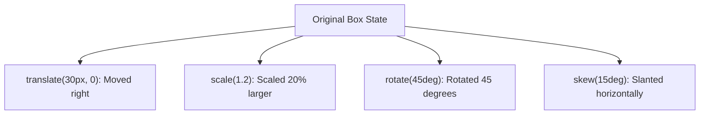

# CSS 2D Transforms

Estimated Reading Time: 12 minutes

Prerequisites: [CSS Transitions](40-css-transitions.md)

Learning Objectives:
- Master the `transform` property for 2D spatial manipulations.
- Understand functions: `translate()`, `scale()`, `rotate()`, and `skew()`.
- Control transformation pivot points using `transform-origin`.
- Combine multiple 2D transform functions without breaking document layout flow.

---

## Introduction

The `transform` property modifies the spatial appearance and orientation of HTML elements in 2D space without altering normal document layout flow.

Using 2D transform functions—`translate()` (moving), `scale()` (resizing), `rotate()` (spinning), and `skew()` (slanting)—developers can move buttons on hover, zoom images, and tilt cards on 60fps GPU compositor layers without triggering costly layout reflow operations.

---

## Real-World Analogy

Imagine a physical photo print resting on a table.

- **`translate(20px, -10px)`**: Sliding the photo 20mm right and 10mm up across the table surface.
- **`scale(1.2)`**: Viewing the photo through a magnifying glass to make it 20% larger.
- **`rotate(45deg)`**: Spinning the photo print 45 degrees clockwise around its center pin.
- **`skew(10deg)`**: Pulling top and bottom photo edges diagonally to slant the picture into a parallelogram.

2D transforms manipulate element spatial geometry.

---

## Core Concepts

### 1. The 4 Core 2D Functions
- `translate(x, y)`: Moves element along X and Y axes (`translate(20px, -10px)`).
- `scale(x, y)`: Scales element size (`scale(1.1)`).
- `rotate(angle)`: Rotates element by degree angles (`rotate(45deg)`).
- `skew(x-angle, y-angle)`: Slants element along axes (`skew(10deg, 5deg)`).

### 2. Transform Pivot Point (`transform-origin`)
Sets the anchor point around which rotations and scalings occur (`transform-origin: center`, `top left`, `50% 50%`). Default is `center` (`50% 50%`).

### 3. Layout Independence
Transforms alter **visual geometry only**. Adjacent sibling elements do NOT move or reflow when an element scales or translates.

---

## Syntax

```css
/* Individual Functions */
.move { transform: translate(20px, 40px); }
.zoom { transform: scale(1.1); }
.spin { transform: rotate(45deg); }
.slant { transform: skew(10deg); }

/* Combining Multiple Functions (Space-Separated) */
.combo {
    transform: translate(-50%, -50%) scale(1.05) rotate(5deg);
}

/* Transform Origin Pivot */
.pivot {
    transform: rotate(45deg);
    transform-origin: top left;
}
```

---

## Property Reference

| Transform Function | Action | Example Syntax |
| :--- | :--- | :--- |
| `translate(x, y)` | Moves element along X and Y axes | `transform: translate(20px, -10px);` |
| `translateX(x)` | Moves element along X-axis (horizontal) | `transform: translateX(50px);` |
| `translateY(y)` | Moves element along Y-axis (vertical) | `transform: translateY(-5px);` |
| `scale(x, y)` | Resizes element proportionally | `transform: scale(1.2);` |
| `rotate(deg)` | Rotates element around origin pin | `transform: rotate(180deg);` |
| `skew(x-deg, y-deg)` | Slants element into parallelogram | `transform: skew(10deg);` |

---

## Visual Explanation



---

## Example 1

### HTML
```html
<!DOCTYPE html>
<html lang="en">
<head>
    <meta charset="UTF-8">
    <title>Hover Zoom Card</title>
    <style>
        body { font-family: Arial, sans-serif; padding: 40px; background-color: #f8fafc; }
        
        .card-container {
            width: 280px;
            overflow: hidden; /* Clips image scale overflow */
            border-radius: 8px;
            border: 1px solid #cbd5e1;
            background-color: white;
        }
        
        .card-img {
            width: 100%;
            height: 180px;
            object-fit: cover;
            display: block;
            
            /* GPU Accelerated Scale Transition */
            transition: transform 0.4s ease;
        }
        
        .card-container:hover .card-img {
            transform: scale(1.08);
        }
        
        .card-body { padding: 15px; }
    </style>
</head>
<body>
    <div class="card-container">
        
        <div class="card-body">
            <h4 style="margin:0;">Hover Zoom Image</h4>
        </div>
    </div>
</body>
</html>
```

### CSS
```css
.card-img {
    transition: transform 0.4s ease;
}
.card-container:hover .card-img {
    transform: scale(1.08);
}
```

### Explanation
`transform: scale(1.08)` scales the image up by 8% inside the overflow-clipped container on hover.

---

## Output Image Prompt

A browser window showing a product card whose header photo zooms in smoothly on hover without pushing text content down.

---

## Code Explanation

- `transform: scale(1.08);`: Scales image dimensions smoothly.
- `overflow: hidden;`: Clips scaling borders neatly inside card bounds.

---

## Example 2

### HTML
```html
<!DOCTYPE html>
<html lang="en">
<head>
    <meta charset="UTF-8">
    <title>Absolute Center with Translate</title>
    <style>
        body { margin: 0; min-height: 100vh; position: relative; font-family: Arial, sans-serif; background-color: #0f172a; }
        
        .modal-box {
            position: absolute;
            top: 50%;
            left: 50%;
            transform: translate(-50%, -50%); /* Perfect centering trick */
            
            background-color: #ffffff;
            padding: 30px;
            border-radius: 10px;
            text-align: center;
        }
    </style>
</head>
<body>
    <div class="modal-box">
        <h3 style="margin-top:0;">Centered Modal</h3>
        <p style="margin:0; color:#64748b;">Centered using position: absolute and transform: translate(-50%, -50%).</p>
    </div>
</body>
</html>
```

### CSS
```css
.modal-box {
    position: absolute;
    top: 50%;
    left: 50%;
    transform: translate(-50%, -50%);
}
```

### Explanation
`transform: translate(-50%, -50%)` shifts the element left and up by 50% of its own width and height, centering it in 2 lines of CSS.

---

## Output Image Prompt

A browser window showing a modal dialog box centered in the screen against a dark background.

---

## Code Explanation

- `translate(-50%, -50%)`: Shifts box backward by half its width and height to achieve perfect centering.

---

## Best Practices

- **Use `translate` Instead of `top`/`left`**: Use `transform: translate()` for animations to leverage 60fps GPU acceleration.
- **Use `transform-origin` for Custom Rotations**: Set `transform-origin: top left` when swinging clock hands or opening doors.

---

## Common Mistakes

### Mistake 1: Multiple `transform` Rules Overwriting Each Other

```css
/* INCORRECT */
.box {
    transform: scale(1.2);
    transform: rotate(45deg); /* Overwrites scale! Only rotate(45deg) will apply */
}
```

#### Explanation
Multiple `transform` property rules do NOT merge—the lower rule completely overwrites upper rules.

```css
/* CORRECT */
.box {
    transform: scale(1.2) rotate(45deg); /* Combined in single space-separated declaration */
}
```

---

## Browser Compatibility

CSS 2D Transforms have 100% universal support across all desktop and mobile web browsers.

---

## Real-World Applications

- **Card Image Zoom**: `transform: scale(1.08)`.
- **Button Hover Lift**: `transform: translateY(-3px)`.
- **Absolute Element Centering**: `transform: translate(-50%, -50%)`.

---

## Mini Project

### Project Objective: Interactive Hover Card with Scale & Lift
Build a card component that lifts upward (`translateY(-5px)`) and scales (`scale(1.02)`) smoothly on hover.

---

## Practice Exercises

### Beginner Level
1. Move an element right 20px using `transform: translateX(20px);`.
2. Move an element up 10px using `transform: translateY(-10px);`.
3. Scale an element to 120% using `transform: scale(1.2);`.
4. Rotate an element 45 degrees using `transform: rotate(45deg);`.
5. Slant an element horizontally using `transform: skewX(10deg);`.

### Intermediate Level
6. Combine scale and rotate in one rule (`transform: scale(1.1) rotate(5deg);`).
7. Center an absolute element using `translate(-50%, -50%)`.
8. Change pivot origin to top-left corner (`transform-origin: top left`).
9. Build a smooth image zoom hover card.
10. Rotate a chevron dropdown arrow 180 degrees on menu toggle.

### Advanced Level
11. Audit GPU compositor layer promotion triggered by transforms.
12. Combine 2D transforms with `@keyframes` animations.
13. Troubleshoot blurry font rendering caused by sub-pixel `translate` values.
14. Optimize transform performance using `will-change: transform`.
15. Solve mobile Safari fixed element transform z-index clipping bugs.

---

## Quick Quiz

**1. Which CSS property modifies spatial orientation in 2D space?**
A) `transform`  
B) `position`  

**2. Which function moves an element horizontally and vertically?**
A) `translate(x, y)`  
B) `move()`  

**3. What does `scale(1.5)` do?**
A) Increases element size to 150%  
B) Rotates element 15 degrees  

**4. What default pivot anchor point is used for `transform: rotate()`?**
A) `center` (`50% 50%`)  
B) `top left`  

**5. How are multiple transform functions combined in one CSS declaration?**
A) Space-separated (`transform: scale(1.1) rotate(45deg);`)  
B) Comma-separated  

**6. Does applying `transform` cause adjacent sibling elements to reflow?**
A) No (transforms alter visual rendering without reflowing DOM siblings)  
B) Yes  

**7. What function slants an element into a parallelogram shape?**
A) `skew()`  
B) `rotate()`  

**8. What property changes rotation anchor points?**
A) `transform-origin`  
B) `transform-pivot`  

**9. What transform trick centers absolute elements perfectly?**
A) `transform: translate(-50%, -50%)`  
B) `transform: scale(0)`  

**10. Why are transforms faster than animating `top` or `left`?**
A) Transforms run on hardware-accelerated GPU compositor layers  
B) Transforms use less HTML  

---

### Answers
1: A | 2: A | 3: A | 4: A | 5: A | 6: A | 7: A | 8: A | 9: A | 10: A

---

## Interview Questions

**1. What is the `transform` property in CSS?**  
*Answer:* `transform` applies 2D or 3D spatial manipulations (`translate`, `scale`, `rotate`, `skew`) to elements, modifying their visual rendering without altering normal document layout flow.

**2. Why is `transform: translate()` preferred over `top`/`left` for smooth animations?**  
*Answer:* Animating `top` or `left` forces the browser engine to recalculate layout geometry (Reflow) and re-paint the viewport on every frame. `transform: translate()` executes on the GPU Compositor thread, bypassing layout and paint cycles for 60fps performance.

**3. How does `transform-origin` work?**  
*Answer:* `transform-origin` specifies the anchor coordinate point (`top left`, `center`, `50% 50%`) around which spatial transforms like rotations and scalings pivot.

---

## Summary

- Use **`transform`** for 2D spatial manipulations.
- **`translate(x, y)`**: Move elements.
- **`scale(x, y)`**: Resize elements.
- **`rotate(deg)`**: Rotate elements.
- Combine using space-separated functions.

---

## Cheat Sheet

```css
/* COMBINED TRANSFORM PATTERN */
.card:hover {
    transform: translateY(-4px) scale(1.02);
}

/* ABSOLUTE CENTERING TRICK */
.centered-modal {
    position: absolute;
    top: 50%;
    left: 50%;
    transform: translate(-50%, -50%);
}
```

---

## Related Topics

- **Previous Topic**: [CSS Animations](41-css-animations.md)
- **Next Topic**: [CSS 3D Transforms](43-css-3d-transforms.md)
- **Recommended Learning Order**: Introduction to CSS -> Ways to Add CSS -> CSS Selectors -> CSS Colors -> CSS Fonts -> CSS Borders -> Border Radius -> CSS Shadows -> CSS Margins -> CSS Padding -> CSS Width -> CSS Height -> CSS Box Model -> CSS Float -> CSS Overflow -> CSS Display -> CSS Position -> CSS Background Images -> CSS Background Properties -> CSS Combinators -> CSS Pseudo Classes -> CSS Pseudo Elements -> CSS Pagination -> CSS Dropdown Menu -> CSS Navigation Bar -> Responsive Web Design -> Media Queries -> CSS Flexbox -> Flex Direction -> Justify Content -> Align Items -> Align Self -> Flex Wrap -> Gap -> Order -> CSS Grid -> Grid Template Columns -> Grid Template Rows -> CSS Transitions -> CSS Animations -> CSS 2D Transforms -> CSS 3D Transforms
