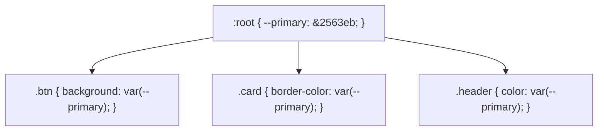

# CSS Variables

Estimated Reading Time: 15 minutes

Prerequisites: [CSS Selectors](03-css-selectors.md), [CSS Colors](04-css-colors.md)

Learning Objectives:
- Master CSS Custom Properties (`--variable-name`) and the `var()` function.
- Understand global scoping (`:root`) vs local scoping.
- Implement dynamic runtime theme switching (Light / Dark Mode).
- Provide fallback values inside `var()` functions.

---

## Introduction

**CSS Custom Properties** (commonly called **CSS Variables**) allow developers to store reusable values—such as brand hex colors, spacing padding units, font stacks, or shadow values—in custom named CSS properties and access them across stylesheets using the `var()` function.

Unlike Sass/SCSS preprocessor variables that compile into static CSS values at build time, CSS Custom Properties are dynamic native browser variables that cascade down the DOM tree, inherit values, and can be updated instantly at runtime using CSS or JavaScript.

---

## Real-World Analogy

Imagine paint swatch reference cards in an interior design project.

- **Without CSS Variables**: Writing down the exact hex paint code `#2563eb` on 500 individual sticky notes across a house. If the client decides to change blue paint to purple `#7c3aed`, you must hunt down and rewrite all 500 sticky notes individually.
- **With CSS Variables (`--primary-color: #2563eb`)**: Labeling the master paint bucket "Primary Color". Sticky notes simply say "Use Primary Color". To switch the theme to purple, you change the paint inside the single master bucket once, and every room updates automatically!

CSS variables centralize design system tokens.

---

## Core Concepts

### 1. Declaring Variables
Variables start with two dashes (`--`) and are case-sensitive:
```css
:root {
    --primary-color: #2563eb;
    --spacing-md: 16px;
    --font-heading: 'Inter', sans-serif;
}
```

### 2. Global Scope (`:root`)
`:root` matches the root `<html>` element, making variables accessible everywhere across the stylesheet.

### 3. Local Scoping & Fallbacks
Variables can be overridden locally inside specific selectors or passed fallbacks:
```css
.card {
    /* Fallback value used if --card-bg is undefined */
    background-color: var(--card-bg, #ffffff);
}
```

---

## Syntax

```css
/* 1. Global Variable Declarations */
:root {
    --brand-blue: #2563eb;
    --brand-dark: #0f172a;
    --card-radius: 8px;
}

/* 2. Accessing Variables with var() */
.button {
    background-color: var(--brand-blue);
    border-radius: var(--card-radius);
    padding: 12px 24px;
    color: #ffffff;
}

/* 3. Dynamic Dark Mode Theme Override */
[data-theme="dark"] {
    --brand-blue: #3b82f6;
    --brand-dark: #ffffff;
}
```

---

## Property Reference

| Syntax Pattern | Scope | Purpose |
| :--- | :--- | :--- |
| `:root { --primary: #2563eb; }` | Global (`<html>`) | Global design system color token |
| `var(--primary)` | Selector | Accesses variable value |
| `var(--primary, #000000)` | Selector | Accesses variable with backup fallback |
| `.card { --card-bg: red; }` | Local Component | Local variable scope for `.card` subtree |

---

## Visual Explanation



---

## Example 1

### HTML
```html
<!DOCTYPE html>
<html lang="en">
<head>
    <meta charset="UTF-8">
    <title>CSS Variables Design System</title>
    <style>
        /* Global Design Tokens */
        :root {
            --primary-color: #2563eb;
            --primary-hover: #1d4ed8;
            --surface-color: #ffffff;
            --text-color: #0f172a;
            --border-radius: 8px;
            --shadow-md: 0 4px 6px -1px rgba(0, 0, 0, 0.1);
        }
        
        body {
            font-family: Arial, sans-serif;
            background-color: #f8fafc;
            color: var(--text-color);
            padding: 40px;
        }
        
        .card {
            background-color: var(--surface-color);
            border-radius: var(--border-radius);
            box-shadow: var(--shadow-md);
            padding: 24px;
            max-width: 320px;
        }
        
        .btn {
            background-color: var(--primary-color);
            color: #ffffff;
            border: none;
            padding: 10px 20px;
            border-radius: var(--border-radius);
            font-weight: bold;
            cursor: pointer;
            transition: background-color 0.2s;
        }
        
        .btn:hover {
            background-color: var(--primary-hover);
        }
    </style>
</head>
<body>
    <div class="card">
        <h3>Variable Token Card</h3>
        <p>Styled using centralized CSS custom properties.</p>
        <button class="btn">Primary Action</button>
    </div>
</body>
</html>
```

### CSS
```css
:root {
    --primary-color: #2563eb;
    --border-radius: 8px;
}
.btn {
    background-color: var(--primary-color);
    border-radius: var(--border-radius);
}
```

### Explanation
All design tokens are defined inside `:root`. Components consume token values via `var()`, ensuring consistent application styling.

---

## Output Image Prompt

A browser window showing a card styled cleanly with blue button accents and soft drop shadow generated via CSS custom properties.

---

## Code Explanation

- `:root`: Global root pseudo-class declaring variables accessible across document.
- `var(--primary-color)`: Function extracting target variable value.

---

## Example 2

### HTML
```html
<!DOCTYPE html>
<html lang="en">
<head>
    <meta charset="UTF-8">
    <title>Dynamic Theme Toggle</title>
    <style>
        :root {
            --bg-color: #ffffff;
            --text-color: #0f172a;
            --card-bg: #f8fafc;
        }
        
        /* Dark Theme Override */
        [data-theme="dark"] {
            --bg-color: #0f172a;
            --text-color: #ffffff;
            --card-bg: #1e293b;
        }
        
        body {
            background-color: var(--bg-color);
            color: var(--text-color);
            font-family: Arial, sans-serif;
            padding: 40px;
            transition: background-color 0.3s, color 0.3s;
        }
        
        .theme-card {
            background-color: var(--card-bg);
            padding: 20px;
            border-radius: 8px;
        }
    </style>
</head>
<body data-theme="dark">
    <div class="theme-card">
        <h2>Dark Theme Active</h2>
        <p>Switching [data-theme="dark"] updates all CSS variables instantly across the document.</p>
    </div>
</body>
</html>
```

### CSS
```css
:root { --bg-color: #ffffff; --text-color: #0f172a; }
[data-theme="dark"] { --bg-color: #0f172a; --text-color: #ffffff; }
body { background: var(--bg-color); color: var(--text-color); }
```

### Explanation
Toggling `[data-theme="dark"]` on `<body>` updates background and text variables dynamically without requiring multiple CSS rule overrides.

---

## Output Image Prompt

A browser window showing a dark slate dashboard canvas (`#0f172a`) with white heading text rendered via dynamic theme variables.

---

## Code Explanation

- `[data-theme="dark"]`: Attribute selector overriding `:root` variables to switch themes dynamically.

---

## Best Practices

- **Declare Global Variables in `:root`**: Place design system tokens (`--color-primary`, `--spacing-md`) inside `:root`.
- **Use Clear Naming Conventions**: Use semantic names (`--color-primary`, `--font-size-lg`) rather than specific value names (`--blue-color`).

---

## Common Mistakes

### Mistake 1: Missing `--` Prefix When Declaring Variables

```css
/* INCORRECT */
:root {
    primary-color: #2563eb; /* Missing leading -- dashes! Invalid CSS variable declaration */
}
```

#### Explanation
CSS custom properties **must** begin with two leading dashes (`--`).

```css
/* CORRECT */
:root {
    --primary-color: #2563eb;
}
```

---

## Browser Compatibility

CSS Custom Properties (`var()`) have 100% universal support across all desktop and mobile web browsers.

---

## Real-World Applications

- **Light/Dark Mode Theme Systems**: Toggling themes with a single HTML data attribute.
- **Design System Tokens**: Centralized color, typography, and spacing variables.
- **Dynamic JavaScript Styling**: Updating CSS variables via `element.style.setProperty('--x', val)`.

---

## Mini Project

### Project Objective: Theme Token Switcher Page
Build a web page with a Light/Dark theme system powered by CSS custom properties.

---

## Practice Exercises

### Beginner Level
1. Declare a primary color variable in `:root` (`--primary: #2563eb;`).
2. Consume a variable using `background-color: var(--primary);`.
3. Declare a font family variable (`--font-main: 'Inter', sans-serif;`).
4. Declare a border radius variable (`--radius-sm: 4px;`).
5. Add a fallback value to a variable call (`var(--undefined-var, #000000)`).

### Intermediate Level
6. Build a Dark Mode theme switcher using `[data-theme="dark"]`.
7. Override a variable inside a local component selector (`.special-card`).
8. Create fluid spacing tokens using `calc(var(--spacing-base) * 2)`.
9. Update a CSS variable using JavaScript (`setProperty('--primary', 'purple')`).
10. Combine CSS variables with CSS transitions.

### Advanced Level
11. Audit performance impact of dynamic CSS variable mutations on large DOM trees.
12. Build a user-customizable accent color picker updating CSS variables at runtime.
13. Implement responsive typography scales using CSS variables and `clamp()`.
14. Optimize reflow engine calculations during theme toggles.
15. Solve CSS variable inheritance bugs inside Web Components and Shadow DOM.

---

## Quick Quiz

**1. What prefix is REQUIRED for CSS Custom Properties?**
A) `--` (two leading dashes)  
B) `$`  

**2. What function is used to access a CSS variable value?**
A) `var()`  
B) `get()`  

**3. Where are global CSS variables typically declared?**
A) `:root` pseudo-class  
B) `body` selector only  

**4. Are CSS variable names case-sensitive?**
A) Yes (`--Color` is different from `--color`)  
B) No  

**5. How do you provide a backup fallback value if a variable is missing?**
A) `var(--primary, #000000)`  
B) `var(--primary | #000000)`  

**6. How do CSS Variables differ from Sass preprocessor variables?**
A) CSS Variables are dynamic native browser runtime properties; Sass variables compile into static values at build time  
B) CSS variables do not work in web browsers  

**7. How do you update a CSS variable dynamically via JavaScript?**
A) `document.documentElement.style.setProperty('--primary', '#2563eb')`  
B) `var('--primary') = '#2563eb'`  

**8. Can CSS variables inherit values down the DOM tree?**
A) Yes  
B) No  

**9. What selector matches the document root element (`html`) for global variables?**
A) `:root`  
B) `:base`  

**10. Why is `--color-primary` a better variable name than `--blue`?**
A) Semantic names remain valid if brand theme color changes from blue to purple  
B) Browsers reject the word blue  

---

### Answers
1: A | 2: A | 3: A | 4: A | 5: A | 6: A | 7: A | 8: A | 9: A | 10: A

---

## Interview Questions

**1. What are CSS Custom Properties (Variables) and how do they work?**  
*Answer:* CSS Custom Properties are native browser variables defined using `--variable-name` syntax and accessed via `var()`. They cascade down the DOM tree, inherit values, and can be dynamically updated at runtime via CSS selectors or JavaScript.

**2. How do CSS Variables differ from preprocessor variables like Sass/SCSS?**  
*Answer:* Sass variables are static build-time variables that compile directly into hardcoded CSS output. CSS Custom Properties are native live browser DOM variables that adapt dynamically at runtime, respond to media queries, inherit values down the DOM tree, and interact with JavaScript.

**3. How do you implement a Light/Dark Mode theme system using CSS Variables?**  
*Answer:* Define theme tokens in `:root` (`--bg-color: #fff`, `--text-color: #000`). Override those token values inside a dark attribute selector (`[data-theme="dark"] { --bg-color: #000; --text-color: #fff; }`). Toggling `data-theme="dark"` on `<body>` updates all styled components across the document automatically.

---

## Summary

- Declare variables in **`:root`** using **`--variable-name`**.
- Access values using **`var(--variable-name)`**.
- Provide fallbacks: **`var(--primary, #000)`**.
- Use for dynamic **Light/Dark Mode** themes.

---

## Cheat Sheet

```css
/* GLOBAL DESIGN TOKENS */
:root {
    --primary: #2563eb;
    --radius: 8px;
    --bg-color: #ffffff;
    --text-color: #0f172a;
}

/* DARK THEME OVERRIDE */
[data-theme="dark"] {
    --bg-color: #0f172a;
    --text-color: #ffffff;
}

/* CONSUMING VARIABLES */
.button {
    background-color: var(--primary);
    border-radius: var(--radius);
}

body {
    background-color: var(--bg-color);
    color: var(--text-color);
}
```

---

## Related Topics

- **Previous Topic**: [CSS 3D Transforms](43-css-3d-transforms.md)
- **Next Topic**: [CSS Vendor Prefixes](45-css-vendor-prefixes.md)
- **Recommended Learning Order**: Introduction to CSS -> Ways to Add CSS -> CSS Selectors -> CSS Colors -> CSS Fonts -> CSS Borders -> Border Radius -> CSS Shadows -> CSS Margins -> CSS Padding -> CSS Width -> CSS Height -> CSS Box Model -> CSS Float -> CSS Overflow -> CSS Display -> CSS Position -> CSS Background Images -> CSS Background Properties -> CSS Combinators -> CSS Pseudo Classes -> CSS Pseudo Elements -> CSS Pagination -> CSS Dropdown Menu -> CSS Navigation Bar -> Responsive Web Design -> Media Queries -> CSS Flexbox -> Flex Direction -> Justify Content -> Align Items -> Align Self -> Flex Wrap -> Gap -> Order -> CSS Grid -> Grid Template Columns -> Grid Template Rows -> CSS Transitions -> CSS Animations -> CSS 2D Transforms -> CSS 3D Transforms -> CSS Variables -> CSS Vendor Prefixes
