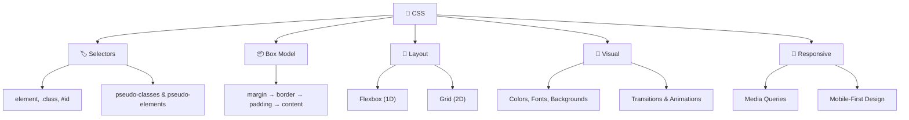

# 🎨 Complete CSS Guide for Web Developers

> **Hey, web artist!** 🖌️ If HTML is the **skeleton**, then CSS is the **skin, clothes, and style**. It makes things look *gorgeous*. Without CSS, every website would look like a boring 1995 text document 😬. Let's make things pretty!

---

## 1. 🤔 What Even IS CSS?

> [!NOTE]
> **CSS** = **Cascading Style Sheets**. It controls how HTML elements **look** — colors, fonts, spacing, layout, animations — everything visual!

- **Cascading** 🌊 — Styles flow down like a waterfall. If two rules conflict, the more *specific* one wins
- **Style** 💅 — Colors, sizes, spacing, fonts — the fashion of the web
- **Sheets** 📄 — You write styles in separate `.css` files (or inside HTML)

> 🧃 **Kid version:** HTML builds the house 🏠. CSS paints the walls, picks the furniture, and hangs the curtains! 🪟

---

## 2. 🔌 Three Ways to Add CSS

### Inline CSS (on the element itself)
```html
<p style="color: red; font-size: 20px;">I'm red and big!</p>
```
> ⚠️ Quick but messy. Avoid in real projects!

### Internal CSS (in the `<head>`)
```html
<head>
    <style>
        p { color: blue; }
    </style>
</head>
```
> 👍 Ok for small projects or single pages.

### External CSS (separate file — ✅ THE BEST WAY)
```html
<head>
    <link rel="stylesheet" href="styles.css">
</head>
```
```css
/* styles.css */
p { color: green; }
```
> 🏆 **Always use this!** Keeps code clean and reusable across pages.

---

## 3. 🏷️ CSS Selectors — Targeting Elements

> Selectors are how you **point at** the HTML you want to style. Like saying *"Hey YOU, the blue heading — change to red!"*

### Basic Selectors

```css
/* Element selector — targets ALL <p> tags */
p { color: navy; }

/* Class selector — targets elements with class="intro" */
.intro { font-size: 18px; }

/* ID selector — targets the ONE element with id="hero" */
#hero { background: gold; }

/* Universal selector — targets EVERYTHING */
* { margin: 0; padding: 0; box-sizing: border-box; }
```

### Combinator Selectors

```css
/* Descendant: any <p> INSIDE a <div> */
div p { color: red; }

/* Child: only DIRECT <p> children of <div> */
div > p { color: blue; }

/* Adjacent sibling: <p> right AFTER an <h2> */
h2 + p { font-weight: bold; }

/* General sibling: ALL <p> after <h2> */
h2 ~ p { color: gray; }
```

### Attribute Selectors

```css
/* Has the attribute */
a[target] { color: orange; }

/* Exact value */
input[type="email"] { border: 2px solid blue; }

/* Starts with */
a[href^="https"] { color: green; }

/* Ends with */
a[href$=".pdf"] { color: red; }

/* Contains */
a[href*="google"] { font-weight: bold; }
```

### Pseudo-Classes 🎭

```css
a:hover { color: red; }           /* Mouse over */
a:active { color: darkred; }      /* While clicking */
a:visited { color: purple; }      /* Already visited */
input:focus { border-color: blue; } /* Currently selected */
li:first-child { font-weight: bold; }
li:last-child { color: gray; }
li:nth-child(2) { color: red; }     /* 2nd item */
li:nth-child(odd) { background: #f0f0f0; } /* Zebra stripes! */
p:not(.special) { color: black; }  /* All p EXCEPT .special */
```

### Pseudo-Elements ✨

```css
p::first-line { font-weight: bold; }
p::first-letter { font-size: 2em; color: red; } /* Drop cap! */
h1::before { content: "🔥 "; }  /* Adds before */
h1::after { content: " ✨"; }   /* Adds after */
::selection { background: yellow; color: black; } /* Highlight color */
input::placeholder { color: gray; font-style: italic; }
```

---

## 4. 📦 The Box Model

> [!IMPORTANT]
> **EVERY element in CSS is a box.** Understanding the box model is like unlocking a superpower! 💪

```
┌────────────────────────────────┐
│           MARGIN               │  ← Space OUTSIDE the border
│  ┌──────────────────────────┐  │
│  │        BORDER            │  │  ← The visible edge
│  │  ┌────────────────────┐  │  │
│  │  │     PADDING        │  │  │  ← Space INSIDE the border
│  │  │  ┌──────────────┐  │  │  │
│  │  │  │   CONTENT     │  │  │  │  ← Your text, images, etc.
│  │  │  └──────────────┘  │  │  │
│  │  └────────────────────┘  │  │
│  └──────────────────────────┘  │
└────────────────────────────────┘
```

```css
.box {
    width: 300px;
    height: 200px;
    padding: 20px;        /* Space inside */
    border: 3px solid black; /* The edge */
    margin: 15px;         /* Space outside */

    /* 🏆 ALWAYS USE THIS — makes width include padding + border */
    box-sizing: border-box;
}

/* Apply to everything (best practice!) */
*, *::before, *::after {
    box-sizing: border-box;
}
```

### Margin Shortcuts

```css
margin: 10px;              /* All sides */
margin: 10px 20px;         /* Top/bottom | Left/right */
margin: 10px 20px 30px 40px; /* Top | Right | Bottom | Left (clockwise 🔄) */
margin: 0 auto;            /* Center a block element horizontally! */
```

> 💡 **Margin collapse:** When two vertical margins touch, they merge into one (the bigger one wins). This is normal!

---

## 5. 🎨 Colors & Backgrounds

### Color Formats
```css
.colors {
    color: red;                    /* Named (140+ names!) */
    color: #ff6347;                /* Hex */
    color: #f64;                   /* Hex shorthand */
    color: rgb(255, 99, 71);       /* RGB */
    color: rgba(255, 99, 71, 0.5); /* RGB + transparency */
    color: hsl(9, 100%, 64%);     /* Hue, Saturation, Lightness */
    color: hsla(9, 100%, 64%, 0.5); /* HSL + transparency */
}
```

### Backgrounds
```css
.bg {
    background-color: #1a1a2e;
    background-image: url('bg.jpg');
    background-size: cover;        /* Fill entire area */
    background-position: center;
    background-repeat: no-repeat;
    background-attachment: fixed;  /* Parallax effect! */

    /* Gradient backgrounds 🌈 */
    background: linear-gradient(135deg, #667eea, #764ba2);
    background: radial-gradient(circle, #ff9a9e, #fecfef);
}
```

---

## 6. ✍️ Typography

```css
.text {
    font-family: 'Inter', 'Segoe UI', sans-serif;
    font-size: 16px;          /* or rem, em, vw */
    font-weight: 700;         /* 100-900, or bold/normal */
    font-style: italic;
    line-height: 1.6;         /* Spacing between lines */
    letter-spacing: 2px;
    word-spacing: 4px;
    text-align: center;       /* left | right | center | justify */
    text-transform: uppercase; /* lowercase | capitalize */
    text-decoration: underline; /* none | line-through | overline */
    text-shadow: 2px 2px 4px rgba(0,0,0,0.3);
    white-space: nowrap;       /* Prevent text wrapping */
    overflow: hidden;
    text-overflow: ellipsis;   /* Shows ... when text overflows */
}
```

### CSS Units Cheat Sheet

| Unit | What It Means 🎯 | When to Use |
| :--- | :--- | :--- |
| `px` | Pixels (fixed) | Borders, small fixed sizes |
| `rem` | Relative to root font-size | **Font sizes, spacing (🏆 best!)** |
| `em` | Relative to parent font-size | Nested scaling |
| `%` | Percentage of parent | Widths, responsive layouts |
| `vw` / `vh` | % of viewport width/height | Full-screen sections |
| `vmin` / `vmax` | Smaller/larger viewport dimension | Responsive typography |
| `ch` | Width of "0" character | Setting max text width |
| `fr` | Fraction of available space | CSS Grid columns |

> 💡 **Pro tip:** Use `rem` for almost everything. Set `html { font-size: 62.5%; }` and then `1rem = 10px`. Easy math!

---

## 7. 📐 Display & Positioning

### Display Property

```css
.block { display: block; }        /* Full width, new line (div, p, h1) */
.inline { display: inline; }      /* Flows with text (span, a, strong) */
.inline-block { display: inline-block; } /* Inline but can have width/height */
.none { display: none; }          /* Completely hidden */
```

### Position Property

| Value | Behavior 🎯 |
| :--- | :--- |
| `static` | Default — normal flow |
| `relative` | Stays in flow, but you can nudge it with `top/left/right/bottom` |
| `absolute` | Removed from flow, positions relative to nearest positioned ancestor |
| `fixed` | Sticks to the viewport (like a sticky navbar!) |
| `sticky` | Normal until you scroll past it, then it sticks! 🍯 |

```css
/* Sticky navbar */
nav {
    position: sticky;
    top: 0;
    z-index: 100;
    background: white;
}

/* Centered absolute element */
.modal {
    position: absolute;
    top: 50%;
    left: 50%;
    transform: translate(-50%, -50%);
}
```

---

## 8. 💪 Flexbox — 1D Layout

> [!NOTE]
> Flexbox is your **best friend** for laying things out in a row or column. It handles alignment like a boss! 🏆

```css
.container {
    display: flex;
    flex-direction: row;       /* row | column | row-reverse | column-reverse */
    justify-content: center;   /* Main axis alignment ←→ */
    align-items: center;       /* Cross axis alignment ↕ */
    gap: 20px;                 /* Space between items */
    flex-wrap: wrap;           /* Items wrap to next line */
}
```

### Justify Content (Main Axis ←→)
```
flex-start:    [A][B][C]              
flex-end:                 [A][B][C]
center:           [A][B][C]
space-between: [A]     [B]     [C]
space-around:   [A]   [B]   [C]
space-evenly:  [A]    [B]    [C]
```

### Align Items (Cross Axis ↕)
```
flex-start:  Items at TOP
flex-end:    Items at BOTTOM
center:      Items in MIDDLE ← most common!
stretch:     Items fill full height (default)
baseline:    Items align by text baseline
```

### Flex Item Properties
```css
.item {
    flex-grow: 1;     /* How much extra space to take */
    flex-shrink: 0;   /* Don't shrink below size */
    flex-basis: 200px; /* Starting size */
    flex: 1;          /* Shorthand: grow=1, shrink=1, basis=0 */
    align-self: flex-end; /* Override alignment for this item */
    order: 2;         /* Change visual order */
}
```

### Common Flexbox Patterns
```css
/* Center anything (the holy grail! 🏆) */
.center-everything {
    display: flex;
    justify-content: center;
    align-items: center;
    min-height: 100vh;
}

/* Navbar with logo left, links right */
.navbar {
    display: flex;
    justify-content: space-between;
    align-items: center;
    padding: 1rem 2rem;
}

/* Equal-width cards */
.card-grid {
    display: flex;
    gap: 1rem;
    flex-wrap: wrap;
}
.card-grid > * {
    flex: 1 1 300px; /* Grow, shrink, min 300px */
}
```

---

## 9. 🏗️ CSS Grid — 2D Layout

> [!IMPORTANT]
> Grid = **rows AND columns** at the same time. It's the most powerful layout system in CSS! 🦸

```css
.grid {
    display: grid;
    grid-template-columns: 1fr 1fr 1fr;  /* 3 equal columns */
    grid-template-rows: auto;
    gap: 20px;
}

/* Shorthand for responsive columns */
.grid-auto {
    display: grid;
    grid-template-columns: repeat(auto-fit, minmax(250px, 1fr));
    gap: 1rem;
}
```

### Grid Item Placement
```css
.item {
    grid-column: 1 / 3;    /* Span column 1 to 3 */
    grid-row: 1 / 2;
    grid-column: span 2;   /* Span 2 columns */
}
```

### Named Grid Areas (Super Readable! ✨)
```css
.layout {
    display: grid;
    grid-template-areas:
        "header header header"
        "sidebar main main"
        "footer footer footer";
    grid-template-columns: 200px 1fr 1fr;
    grid-template-rows: 60px 1fr 50px;
    min-height: 100vh;
}
header  { grid-area: header; }
.sidebar { grid-area: sidebar; }
main    { grid-area: main; }
footer  { grid-area: footer; }
```

### Flexbox vs Grid — When to Use What?

| Use **Flexbox** when... | Use **Grid** when... |
| :--- | :--- |
| Layout is **one direction** (row OR column) | Layout is **two directions** (rows AND columns) |
| Content size should determine layout | You want a **fixed structure** |
| Navbars, card rows, centering | Page layouts, dashboards, galleries |

---

## 10. 📱 Responsive Design & Media Queries

> Making your site look great on ALL screen sizes — from phones 📱 to giant monitors 🖥️

```css
/* Mobile-first approach (start small, scale up) */

/* Base styles = mobile */
.container { padding: 1rem; }
.card { width: 100%; }

/* Tablet and up */
@media (min-width: 768px) {
    .container { padding: 2rem; }
    .card { width: 48%; }
}

/* Desktop and up */
@media (min-width: 1024px) {
    .container { max-width: 1200px; margin: 0 auto; }
    .card { width: 30%; }
}
```

### Common Breakpoints

| Device | Breakpoint |
| :--- | :--- |
| 📱 Mobile | `< 768px` |
| 📱 Tablet | `768px — 1023px` |
| 💻 Desktop | `1024px — 1439px` |
| 🖥️ Large Desktop | `≥ 1440px` |

---

## 11. ✨ Transitions & Animations

### Transitions (A → B smoothly)
```css
.button {
    background: #3498db;
    color: white;
    padding: 12px 24px;
    border: none;
    border-radius: 8px;
    transition: all 0.3s ease;
}
.button:hover {
    background: #2980b9;
    transform: translateY(-2px);
    box-shadow: 0 4px 12px rgba(0,0,0,0.2);
}
```

### Keyframe Animations (Full control! 🎬)
```css
@keyframes bounce {
    0%, 100% { transform: translateY(0); }
    50% { transform: translateY(-20px); }
}

@keyframes fadeIn {
    from { opacity: 0; transform: translateY(20px); }
    to { opacity: 1; transform: translateY(0); }
}

.bouncy { animation: bounce 1s ease infinite; }
.fade-in { animation: fadeIn 0.5s ease forwards; }
```

### Transform Property
```css
.transform-demo {
    transform: translateX(50px);    /* Move right */
    transform: translateY(-20px);   /* Move up */
    transform: rotate(45deg);       /* Spin */
    transform: scale(1.2);          /* Grow 120% */
    transform: skewX(10deg);        /* Tilt */
    /* Combine! */
    transform: translateY(-5px) rotate(2deg) scale(1.05);
}
```

---

## 12. 🃏 Modern CSS Features

### CSS Variables (Custom Properties) 🎛️
```css
:root {
    --primary: #6c5ce7;
    --secondary: #00cec9;
    --bg-dark: #1a1a2e;
    --text: #eaeaea;
    --radius: 12px;
    --shadow: 0 8px 32px rgba(0,0,0,0.3);
}

.card {
    background: var(--primary);
    color: var(--text);
    border-radius: var(--radius);
    box-shadow: var(--shadow);
}

/* Dark mode toggle — just change variables! */
[data-theme="light"] {
    --bg-dark: #ffffff;
    --text: #333333;
}
```

### Glassmorphism 🪟
```css
.glass {
    background: rgba(255, 255, 255, 0.1);
    backdrop-filter: blur(10px);
    -webkit-backdrop-filter: blur(10px);
    border: 1px solid rgba(255, 255, 255, 0.2);
    border-radius: 16px;
}
```

### Scroll Snap 📜
```css
.scroll-container {
    scroll-snap-type: x mandatory;
    overflow-x: auto;
    display: flex;
}
.scroll-item {
    scroll-snap-align: start;
    min-width: 100%;
}
```

### Container Queries 📦
```css
.card-wrapper {
    container-type: inline-size;
}
@container (min-width: 400px) {
    .card { flex-direction: row; }
}
```

---

## 13. 🧹 CSS Reset & Best Practices

### Minimal Reset
```css
*, *::before, *::after {
    margin: 0;
    padding: 0;
    box-sizing: border-box;
}

html {
    font-size: 62.5%; /* 1rem = 10px */
    scroll-behavior: smooth;
}

body {
    font-family: 'Inter', system-ui, sans-serif;
    font-size: 1.6rem; /* 16px */
    line-height: 1.6;
    min-height: 100vh;
    -webkit-font-smoothing: antialiased;
}

img, video, svg {
    display: block;
    max-width: 100%;
}

a { text-decoration: none; color: inherit; }
ul, ol { list-style: none; }
```

### Best Practices Checklist ✅

- ✅ Use **external stylesheets** (not inline)
- ✅ Use **CSS variables** for colors, fonts, spacing
- ✅ Use **`rem`** for font sizes, **`px`** for borders
- ✅ Use **`box-sizing: border-box`** on everything
- ✅ **Mobile-first** approach with `min-width` media queries
- ✅ Use **Flexbox** for 1D, **Grid** for 2D layouts
- ✅ Keep selectors **simple** (avoid deep nesting)
- ✅ Use **BEM naming**: `.block__element--modifier`
- ✅ Add **transitions** on interactive elements (buttons, links)
- ✅ Test on **multiple browsers** and screen sizes

---

## 14. 🎯 CSS Specificity

> When two rules target the same element, who wins? **Specificity** decides! 🏆

```
Inline styles    → 1000 points  (style="...")
ID selectors     → 100 points   (#hero)
Class selectors  → 10 points    (.card, :hover, [type])
Element selectors→ 1 point      (p, div, h1)
Universal (*)    → 0 points
```

```css
p { color: blue; }              /* Specificity: 0-0-1 */
.intro { color: green; }       /* Specificity: 0-1-0 (WINS over p) */
#hero { color: red; }          /* Specificity: 1-0-0 (WINS over .intro) */
p.intro { color: orange; }     /* Specificity: 0-1-1 */
```

> ⚠️ **Avoid `!important`** — it breaks the cascade and makes debugging a nightmare 😱. Fix specificity instead!

---

## 🎯 Quick Recap



> [!TIP]
> **CSS is an art 🎨.** The more you practice, the better your eye gets. Start simple, experiment with DevTools (`F12`), and don't be afraid to break things! 🚀

---

*Made with ❤️ for future web developers who like things explained the fun way!*
